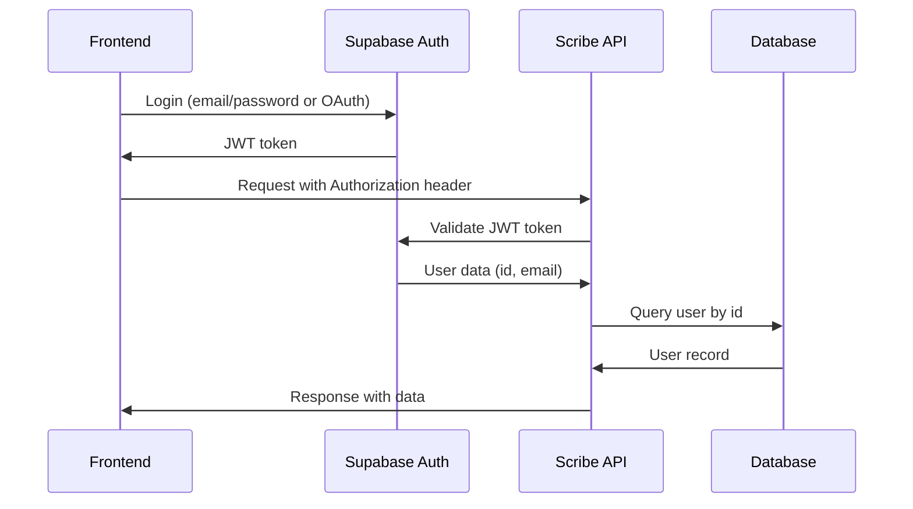

# Authentication

Scribe Backend uses JWT-based authentication powered by Supabase Auth. All protected endpoints require a valid JWT token in the `Authorization` header.

## Authentication Flow



<Note>
Scribe Backend follows a **backend-first** architecture. The frontend uses Supabase only for authentication, while all database operations are handled by the backend with the service role key.
</Note>

## Getting a JWT Token

### Using Supabase Client (Frontend)

```javascript
import { createClient } from '@supabase/supabase-js'

const supabase = createClient(
  process.env.NEXT_PUBLIC_SUPABASE_URL,
  process.env.NEXT_PUBLIC_SUPABASE_ANON_KEY
)

// Sign in with email/password
const { data, error } = await supabase.auth.signInWithPassword({
  email: 'user@example.com',
  password: 'password'
})

if (data?.session) {
  const token = data.session.access_token
  // Use this token for API requests
}
```

### Using OAuth (Google, GitHub, etc.)

```javascript
const { data, error } = await supabase.auth.signInWithOAuth({
  provider: 'google'
})
```

## Making Authenticated Requests

Include the JWT token in the `Authorization` header with the `Bearer` scheme:

```bash
curl -X GET https://scribeapi.manitmishra.com/api/user/profile \
  -H "Authorization: Bearer YOUR_JWT_TOKEN"
```

### Example with JavaScript fetch

```javascript
const response = await fetch('https://scribeapi.manitmishra.com/api/email/generate', {
  method: 'POST',
  headers: {
    'Authorization': `Bearer ${token}`,
    'Content-Type': 'application/json'
  },
  body: JSON.stringify({
    email_template: 'Hi {{name}}, I loved your work on {{research}}!',
    recipient_name: 'Dr. Jane Smith',
    recipient_interest: 'machine learning'
  })
})

const data = await response.json()
```

## Backend Implementation

### JWT Validation

The backend validates JWT tokens using two dependency functions from `api/dependencies.py`:

#### get_supabase_user

Validates the JWT token and extracts user data from Supabase:

```python
async def get_supabase_user(
    authorization: str = Header(None)
) -> SupabaseUser:
    if not authorization or not authorization.startswith("Bearer "):
        raise HTTPException(
            status_code=status.HTTP_401_UNAUTHORIZED,
            detail="Missing or invalid authorization header"
        )

    token = authorization.replace("Bearer ", "")
    supabase = get_supabase_client()

    try:
        user_data = supabase.auth.get_user(token)
        return SupabaseUser(
            id=user_data.user.id,
            email=user_data.user.email
        )
    except Exception as e:
        raise HTTPException(
            status_code=status.HTTP_401_UNAUTHORIZED,
            detail="Invalid or expired token"
        )
```

#### get_current_user

Fetches the user record from the local database:

```python
async def get_current_user(
    supabase_user: SupabaseUser = Depends(get_supabase_user),
    db: Session = Depends(get_db)
) -> User:
    user = db.query(User).filter(User.id == supabase_user.id).first()

    if not user:
        raise HTTPException(
            status_code=status.HTTP_403_FORBIDDEN,
            detail="User not initialized. Call POST /api/user/init first."
        )

    return user
```

### Protected Route Example

```python
from fastapi import APIRouter, Depends
from api.dependencies import get_current_user
from models.user import User

router = APIRouter(prefix="/api/email", tags=["Email"])

@router.get("/")
async def get_emails(
    current_user: User = Depends(get_current_user),
    db: Session = Depends(get_db)
):
    emails = db.query(Email).filter(
        Email.user_id == current_user.id
    ).all()

    return emails
```

## User Initialization

Before making API requests, users must initialize their profile:

```bash
curl -X POST https://scribeapi.manitmishra.com/api/user/init \
  -H "Authorization: Bearer YOUR_JWT_TOKEN" \
  -H "Content-Type: application/json" \
  -d '{
    "display_name": "John Doe"
  }'
```

<Note>
The `POST /api/user/init` endpoint is idempotent. Calling it multiple times with the same token will return the existing user record.
</Note>

## Error Responses

### 401 Unauthorized

Returned when the JWT token is missing, invalid, or expired:

```json
{
  "detail": "Invalid or expired token"
}
```

### 403 Forbidden

Returned when the user exists in Supabase but hasn't initialized their profile:

```json
{
  "detail": "User not initialized. Call POST /api/user/init first."
}
```

### 503 Service Unavailable

Returned when Supabase is unreachable:

```json
{
  "detail": "Authentication service unavailable"
}
```

## Token Expiration

JWT tokens issued by Supabase have a default expiration time of 1 hour. When a token expires:

1. The API will return a `401 Unauthorized` error
2. The frontend should refresh the token using Supabase's `refreshSession()` method
3. If refresh fails, redirect the user to login

### Refreshing Tokens

```javascript
const { data, error } = await supabase.auth.refreshSession()

if (data?.session) {
  const newToken = data.session.access_token
  // Use the new token for subsequent requests
}
```

## Security Best Practices

<Warning>
**Never expose the Supabase service role key on the frontend.** Only use the anon key for client-side authentication.
</Warning>

<AccordionGroup>
  <Accordion title="Store tokens securely">
    - Use `httpOnly` cookies for web applications
    - Use secure storage (Keychain, KeyStore) for mobile apps
    - Never store tokens in localStorage (vulnerable to XSS)
  </Accordion>

  <Accordion title="Validate tokens on every request">
    - The backend validates tokens on every protected endpoint
    - Tokens are verified against Supabase's JWT secret
    - Expired or tampered tokens are rejected
  </Accordion>

  <Accordion title="Use HTTPS in production">
    - All API requests in production use HTTPS
    - Cloudflare Tunnel provides TLS termination
    - Tokens are encrypted in transit
  </Accordion>

  <Accordion title="Implement token refresh logic">
    - Refresh tokens before they expire (e.g., at 55 minutes)
    - Handle 401 errors gracefully with automatic retry
    - Redirect to login only after refresh fails
  </Accordion>
</AccordionGroup>

## Testing with cURL

For testing, you can obtain a token from the Supabase dashboard or use the Supabase CLI:

```bash
# Get a token using Supabase CLI
supabase auth login
supabase auth token

# Use the token in API requests
TOKEN="your-jwt-token-here"
curl -X GET https://scribeapi.manitmishra.com/api/user/profile \
  -H "Authorization: Bearer $TOKEN"
```

<CardGroup cols={2}>
  <Card title="User Endpoints" icon="user" href="/api/endpoints/user">
    Explore user management endpoints
  </Card>
  <Card title="Error Handling" icon="triangle-exclamation" href="/api/errors">
    Learn about error responses
  </Card>
</CardGroup>
