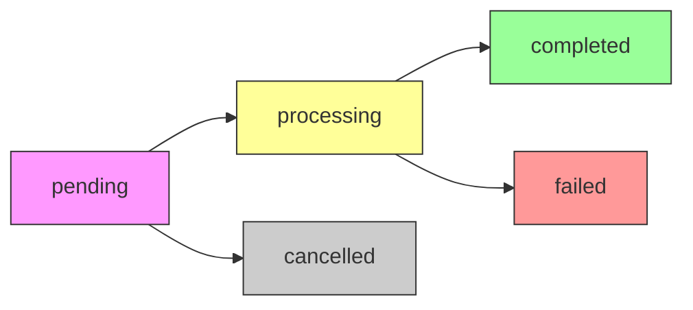

## Overview

The queue status endpoint provides real-time visibility into batch email generation jobs. Poll this endpoint to track queue position, processing progress, and completion status for multiple items simultaneously.

<Info>
**Batch Processing**: Items are processed **sequentially** (concurrency=1) to prevent API rate limits. Queue position indicates when each item will be processed.
</Info>

## Endpoint

```
GET /api/queue/
```

### Authentication

Requires JWT token in Authorization header:

```bash
Authorization: Bearer {your_jwt_token}
```

### Response

Returns array of queue items from the last 24 hours:

```json
[
  {
    "id": "550e8400-e29b-41d4-a716-446655440000",
    "recipient_name": "Dr. Jane Smith",
    "status": "pending",
    "position": 3,
    "email_id": null,
    "error_message": null,
    "current_step": null,
    "created_at": "2025-01-13T10:30:00Z"
  },
  {
    "id": "660e8400-e29b-41d4-a716-446655440001",
    "recipient_name": "Prof. John Doe",
    "status": "processing",
    "position": null,
    "email_id": null,
    "error_message": null,
    "current_step": "web_scraper",
    "created_at": "2025-01-13T10:28:00Z"
  },
  {
    "id": "770e8400-e29b-41d4-a716-446655440002",
    "recipient_name": "Dr. Alice Johnson",
    "status": "completed",
    "position": null,
    "email_id": "880e8400-e29b-41d4-a716-446655440003",
    "error_message": null,
    "current_step": null,
    "created_at": "2025-01-13T10:25:00Z"
  }
]
```

## Queue Item Schema

| Field | Type | Description |
|-------|------|-------------|
| `id` | string | Queue item UUID |
| `recipient_name` | string | Recipient name (2-255 chars) |
| `status` | string | Current status: `pending`, `processing`, `completed`, `failed` |
| `position` | number \| null | Queue position (1-indexed, only for `pending` items) |
| `email_id` | string \| null | Generated email UUID (only for `completed` items) |
| `error_message` | string \| null | Error details (only for `failed` items, max 1000 chars) |
| `current_step` | string \| null | Current pipeline step (only for `processing` items) |
| `created_at` | string | ISO 8601 timestamp when item was queued |

## Status Types

### pending

Item is waiting in queue. Includes position number:

```json
{
  "id": "550e8400-e29b-41d4-a716-446655440000",
  "recipient_name": "Dr. Jane Smith",
  "status": "pending",
  "position": 3,
  "email_id": null,
  "error_message": null,
  "current_step": null,
  "created_at": "2025-01-13T10:30:00Z"
}
```

**Position Calculation**: Uses FIFO ordering by `created_at` timestamp. Position 1 = next to be processed.

### processing

Item is currently being processed by Celery worker. Includes current pipeline step:

```json
{
  "id": "660e8400-e29b-41d4-a716-446655440001",
  "recipient_name": "Prof. John Doe",
  "status": "processing",
  "position": null,
  "email_id": null,
  "error_message": null,
  "current_step": "web_scraper",
  "created_at": "2025-01-13T10:28:00Z"
}
```

**Pipeline Steps**:
1. `template_parser` - Analyze template and extract search terms (~1-2s)
2. `web_scraper` - Search web and summarize content (~3-5s)
3. `arxiv_helper` - Fetch academic papers (RESEARCH template only, ~2-3s)
4. `email_composer` - Generate final email with LLM (~4-6s)

### completed

Item successfully generated. Contains email ID for retrieval:

```json
{
  "id": "770e8400-e29b-41d4-a716-446655440002",
  "recipient_name": "Dr. Alice Johnson",
  "status": "completed",
  "position": null,
  "email_id": "880e8400-e29b-41d4-a716-446655440003",
  "error_message": null,
  "current_step": null,
  "created_at": "2025-01-13T10:25:00Z"
}
```

<Note>
Use `email_id` to fetch the generated email: `GET /api/email/{email_id}`
</Note>

### failed

Item encountered an error during processing:

```json
{
  "id": "990e8400-e29b-41d4-a716-446655440004",
  "recipient_name": "Dr. Bob Wilson",
  "status": "failed",
  "position": null,
  "email_id": null,
  "error_message": "Web scraping timeout: No results found for search terms after 3 attempts. Please verify recipient information and try again.",
  "current_step": null,
  "created_at": "2025-01-13T10:20:00Z"
}
```

<Note>
**Error Truncation**: Error messages are truncated to 1000 characters to prevent database bloat. See `tasks/email_tasks.py:101-107` for implementation.
</Note>

## Position Calculation

Queue positions are calculated efficiently using SQL window functions:

```python
# From api/routes/queue.py:120-131
positions_query = db.query(
    QueueItem.id,
    func.row_number().over(
        order_by=QueueItem.created_at.asc()
    ).label('position')
).filter(
    QueueItem.status == QueueStatus.PENDING,
    QueueItem.created_at >= cutoff_time
).all()

# Create lookup map: {item_id: position}
position_map = {str(item_id): position for item_id, position in positions_query}
```

**Key Points**:
- **FIFO Ordering**: Positions based on `created_at` timestamp (oldest first)
- **Single Query**: Window function avoids N+1 query problem
- **Pending Only**: Positions only calculated for `pending` items
- **24-Hour Window**: Only items from last 24 hours included

## Polling Strategy

### Recommended Approach

```typescript
interface QueueItem {
  id: string;
  recipient_name: string;
  status: 'pending' | 'processing' | 'completed' | 'failed';
  position: number | null;
  email_id: string | null;
  error_message: string | null;
  current_step: string | null;
  created_at: string;
}

class QueuePoller {
  private intervalId: NodeJS.Timeout | null = null;
  private readonly POLL_INTERVAL = 2000; // 2 seconds
  
  async startPolling(token: string, onUpdate: (items: QueueItem[]) => void) {
    this.intervalId = setInterval(async () => {
      try {
        const response = await fetch('https://api.scribe.example/api/queue/', {
          headers: { 'Authorization': `Bearer ${token}` }
        });
        
        if (!response.ok) {
          throw new Error(`HTTP ${response.status}`);
        }
        
        const items: QueueItem[] = await response.json();
        onUpdate(items);
        
        // Stop polling if all items completed or failed
        const allDone = items.every(item => 
          item.status === 'completed' || item.status === 'failed'
        );
        
        if (allDone) {
          this.stopPolling();
        }
      } catch (error) {
        console.error('Polling error:', error);
      }
    }, this.POLL_INTERVAL);
  }
  
  stopPolling() {
    if (this.intervalId) {
      clearInterval(this.intervalId);
      this.intervalId = null;
    }
  }
}

// Usage
const poller = new QueuePoller();

poller.startPolling(token, (items) => {
  console.log(`Queue status:`);
  items.forEach(item => {
    if (item.status === 'pending') {
      console.log(`  ${item.recipient_name}: Position ${item.position}`);
    } else if (item.status === 'processing') {
      console.log(`  ${item.recipient_name}: ${item.current_step}`);
    } else if (item.status === 'completed') {
      console.log(`  ${item.recipient_name}: ✓ Done (${item.email_id})`);
    } else if (item.status === 'failed') {
      console.log(`  ${item.recipient_name}: ✗ Failed - ${item.error_message}`);
    }
  });
});
```

### Polling Interval

<Info>
**Recommended: 2 seconds**

Balances real-time updates with server load. Adjust based on your needs:

- **High priority batches**: 1-2 seconds
- **Background processing**: 5-10 seconds
- **Low priority**: 30-60 seconds
</Info>

## Status Transitions



**Transition Flow**:

1. **pending** → Item created, waiting in queue
2. **processing** → Celery worker picked up item, executing pipeline
3. **completed** → Email generated and saved to database
4. **failed** → Error encountered during pipeline execution
5. **cancelled** → User manually cancelled pending item (via `DELETE /api/queue/{id}`)

<Note>
**No Automatic Retries**: Failed items remain in `failed` status. Implement retry logic client-side if needed.
</Note>

## Batch Submission

### Submit Multiple Items

```bash
curl -X POST https://api.scribe.example/api/queue/batch \
  -H "Authorization: Bearer {token}" \
  -H "Content-Type: application/json" \
  -d '{
    "items": [
      {
        "recipient_name": "Dr. Jane Smith",
        "recipient_interest": "machine learning"
      },
      {
        "recipient_name": "Prof. John Doe",
        "recipient_interest": "computer vision"
      }
    ],
    "email_template": "Hey {{name}}, I loved your work on {{research}}!"
  }'
```

**Response**:

```json
{
  "queue_item_ids": [
    "550e8400-e29b-41d4-a716-446655440000",
    "660e8400-e29b-41d4-a716-446655440001"
  ],
  "message": "Successfully queued 2 items"
}
```

**Limits**:
- **Max 100 items per batch** (enforced at `api/routes/queue.py:42-46`)
- **Sequential processing** (concurrency=1 to prevent rate limits)
- **24-hour retention** (items automatically removed after 24 hours)

## Cancel Pending Items

### Delete Endpoint

```bash
curl -X DELETE https://api.scribe.example/api/queue/{queue_item_id} \
  -H "Authorization: Bearer {token}"
```

**Response**:

```json
{
  "message": "Queue item cancelled"
}
```

**Restrictions**:
- Only `pending` items can be cancelled
- `processing`, `completed`, or `failed` items return 400 error
- Celery task is revoked gracefully (`terminate=False`)

```python
# From api/routes/queue.py:186-190
if item.status != QueueStatus.PENDING:
    raise HTTPException(
        status_code=status.HTTP_400_BAD_REQUEST,
        detail=f"Cannot cancel item with status '{item.status}'"
    )
```

## Implementation Details

### Backend Architecture

**Queue Persistence**: Items stored in PostgreSQL (`queue_items` table)

```python
# From api/routes/queue.py:48-63
for item in batch_request.items:
    queue_item = QueueItem(
        user_id=current_user.id,
        recipient_name=item.recipient_name,
        recipient_interest=item.recipient_interest,
        email_template=batch_request.email_template,
        status=QueueStatus.PENDING,
    )
    db.add(queue_item)
    queue_items.append((queue_item, item))

db.flush()  # Assign IDs to all items
db.commit()  # Commit so items are visible to Celery workers
```

**Celery Task Dispatch**: After database commit, tasks are dispatched:

```python
# From api/routes/queue.py:68-81
for queue_item, item in queue_items:
    task = generate_email_task.apply_async(
        kwargs={
            "queue_item_id": str(queue_item.id),
            "user_id": str(current_user.id),
            "email_template": batch_request.email_template,
            "recipient_name": item.recipient_name,
            "recipient_interest": item.recipient_interest,
        },
        queue="email_default"
    )
    
    queue_item.celery_task_id = task.id
    queue_item_ids.append(str(queue_item.id))

db.commit()  # Persist celery_task_id references
```

### Status Updates in Tasks

**Progress Tracking**: Tasks update queue item status during execution:

```python
# From tasks/email_tasks.py:200-210
async def progress_callback(step_name: str, step_status: str) -> None:
    _update_status(
        JobStatus.RUNNING,
        {
            "current_step": step_name,
            "step_status": step_status,
            "step_timings": pipeline_data.step_timings,
        },
    )
    # Also update database queue status
    update_queue_status(QueueStatus.PROCESSING, current_step=step_name)
```

**Completion Handling**:

```python
# From tasks/email_tasks.py:335-338
_update_status(
    JobStatus.COMPLETED,
    {"email_id": email_id_str, "total_duration": total_duration}
)
update_queue_status(QueueStatus.COMPLETED, email_id=email_id_str)
```

## Best Practices

### 1. Auto-Stop Polling

Stop polling when all items reach terminal states:

```typescript
function shouldStopPolling(items: QueueItem[]): boolean {
  return items.every(item => 
    item.status === 'completed' || item.status === 'failed'
  );
}
```

### 2. Progress Visualization

Show real-time progress in UI:

```typescript
function getProgressPercentage(item: QueueItem): number {
  const stepProgress = {
    'template_parser': 25,
    'web_scraper': 50,
    'arxiv_helper': 75,
    'email_composer': 90
  };
  
  if (item.status === 'completed') return 100;
  if (item.status === 'failed') return 0;
  if (item.status === 'processing' && item.current_step) {
    return stepProgress[item.current_step] || 0;
  }
  return 0; // pending
}
```

### 3. Error Handling

```typescript
function handleQueueErrors(items: QueueItem[]) {
  const failed = items.filter(item => item.status === 'failed');
  
  if (failed.length > 0) {
    console.error(`${failed.length} items failed:`);
    failed.forEach(item => {
      console.error(`  ${item.recipient_name}: ${item.error_message}`);
      
      // Retry transient errors
      if (item.error_message?.includes('timeout')) {
        console.log(`  -> Retrying ${item.recipient_name}`);
        // Resubmit to queue
      }
    });
  }
}
```

### 4. Estimate Wait Time

Calculate expected processing time based on position:

```typescript
function estimateWaitTime(item: QueueItem): string {
  if (!item.position) return 'Processing now';
  
  const AVG_PROCESSING_TIME = 12; // seconds per item
  const waitSeconds = item.position * AVG_PROCESSING_TIME;
  
  if (waitSeconds < 60) {
    return `~${waitSeconds}s`;
  } else {
    const minutes = Math.ceil(waitSeconds / 60);
    return `~${minutes} min`;
  }
}
```

## Common Issues

### Position Not Updating

**Symptom**: Item stuck at same position for >30 seconds.

**Causes**:
- Celery worker not processing tasks
- Item ahead in queue is hung
- Worker crashed

**Solution**:
```bash
# Check worker status
celery -A celery_config inspect active

# Check for stuck tasks
celery -A celery_config inspect active_queues
```

### Items Missing from Response

**Symptom**: Submitted items not appearing in queue.

**Causes**:
- Items older than 24 hours (auto-removed)
- User authentication mismatch
- Database transaction not committed

**Solution**:
```python
# Verify item exists
item = db.query(QueueItem).filter(
    QueueItem.id == queue_item_id
).first()

if not item:
    print("Item not found in database")
elif item.created_at < datetime.now() - timedelta(hours=24):
    print("Item expired (>24 hours old)")
```

### Status Stuck at `processing`

**Symptom**: Item remains `processing` for >5 minutes.

**Causes**:
- Pipeline step hung (web scraping timeout)
- Worker crashed mid-execution
- Database not updating

**Solution**: Implement client-side timeout and allow manual retry:

```typescript
function detectStuckItems(items: QueueItem[]): QueueItem[] {
  return items.filter(item => {
    if (item.status !== 'processing') return false;
    
    const age = Date.now() - new Date(item.created_at).getTime();
    return age > 300000; // 5 minutes
  });
}
```

## Related Endpoints

- [POST /api/queue/batch](/api/batch-submission) - Submit batch of email generation requests
- [DELETE /api/queue/{id}](/api/cancel-queue-item) - Cancel pending queue item
- [GET /api/email/{email_id}](/api/email-retrieval) - Retrieve generated email
- [GET /api/email/status/{task_id}](/api/task-status) - Check individual task status