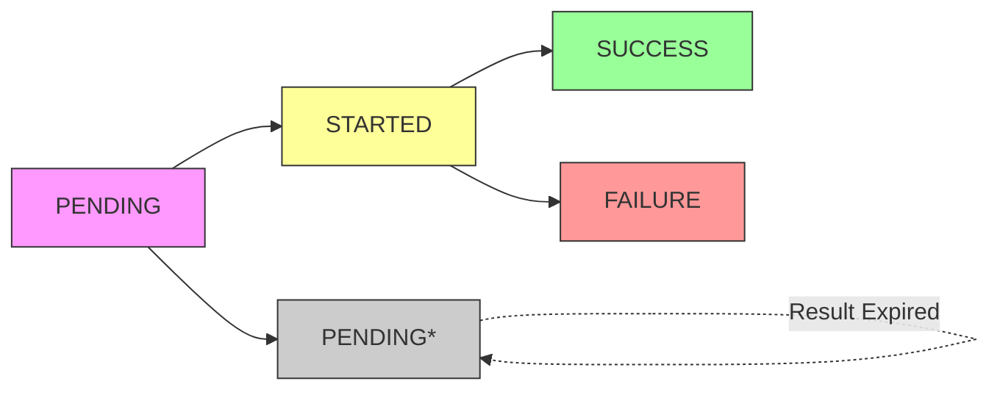

## Overview

The task status endpoint provides real-time information about email generation tasks using Celery's result backend. Poll this endpoint to track progress, retrieve results, or handle errors.

<Info>
**Result Expiration**: Task results expire after **1 hour** (3600 seconds). Poll frequently and retrieve results promptly.
</Info>

## Endpoint

```
GET /api/email/status/{task_id}
```

### Authentication

Requires JWT token in Authorization header:

```bash
Authorization: Bearer {your_jwt_token}
```

### Path Parameters

| Parameter | Type | Description |
|-----------|------|-------------|
| `task_id` | string | Celery task ID returned from `/api/email/generate` |

## Task States

### PENDING

Task is queued or result has expired.

```json
{
  "task_id": "abc-123-def-456",
  "status": "PENDING",
  "result": null,
  "error": null
}
```

<Note>
**Ambiguous State**: `PENDING` can mean either "task not started yet" or "result expired (>1 hour old)". Track submission time client-side to differentiate.
</Note>

### STARTED

Task is actively executing. Includes progress information:

```json
{
  "task_id": "abc-123-def-456",
  "status": "STARTED",
  "result": {
    "current_step": "web_scraper",
    "step_status": "running",
    "step_timings": {
      "template_parser": 1.2,
      "web_scraper": 3.4
    }
  },
  "error": null
}
```

**Progress Fields**:

- `current_step`: Current pipeline step (`template_parser`, `web_scraper`, `arxiv_helper`, `email_composer`)
- `step_status`: Step status (`started`, `running`, `completed`)
- `step_timings`: Elapsed time per step in seconds

### SUCCESS

Task completed successfully. Contains the generated email ID:

```json
{
  "task_id": "abc-123-def-456",
  "status": "SUCCESS",
  "result": {
    "task_id": "abc-123-def-456",
    "status": "completed",
    "email_id": "550e8400-e29b-41d4-a716-446655440000",
    "metadata": {
      "step_timings": {
        "template_parser": 1.2,
        "web_scraper": 3.4,
        "arxiv_helper": 2.1,
        "email_composer": 4.8
      },
      "total_duration": 11.5,
      "template_type": "research"
    }
  },
  "error": null
}
```

<Note>
Use `result.email_id` to fetch the generated email via `GET /api/email/{email_id}`.
</Note>

### FAILURE

Task failed with error details:

```json
{
  "task_id": "abc-123-def-456",
  "status": "FAILURE",
  "result": null,
  "error": {
    "message": "Web scraping timeout: No results found for search terms",
    "type": "StepExecutionError",
    "failed_step": "web_scraper"
  }
}
```

**Error Fields**:

- `message`: Human-readable error description
- `type`: Exception class name
- `failed_step`: Pipeline step that failed (if applicable)

## Polling Strategy

### Recommended Approach

```python
import time
import requests

def poll_task_status(task_id: str, token: str, timeout: int = 300) -> dict:
    """
    Poll task status until completion or timeout.
    
    Args:
        task_id: Celery task ID
        token: JWT authentication token
        timeout: Maximum seconds to poll (default 5 minutes)
    
    Returns:
        Final task status response
    """
    url = f"https://api.scribe.example/api/email/status/{task_id}"
    headers = {"Authorization": f"Bearer {token}"}
    
    start_time = time.time()
    interval = 2  # Poll every 2 seconds
    
    while True:
        response = requests.get(url, headers=headers)
        data = response.json()
        
        status = data["status"]
        
        # Terminal states
        if status in ["SUCCESS", "FAILURE"]:
            return data
        
        # Check timeout
        elapsed = time.time() - start_time
        if elapsed > timeout:
            raise TimeoutError(f"Task polling timeout after {timeout}s")
        
        # Log progress for STARTED tasks
        if status == "STARTED" and data.get("result"):
            step = data["result"].get("current_step", "unknown")
            print(f"Progress: {step}")
        
        time.sleep(interval)

# Usage
try:
    result = poll_task_status("abc-123-def-456", "your_token_here")
    
    if result["status"] == "SUCCESS":
        email_id = result["result"]["email_id"]
        print(f"Email generated: {email_id}")
    else:
        error = result["error"]
        print(f"Task failed: {error['message']}")
        
except TimeoutError as e:
    print(f"Timeout: {e}")
```

### Polling Intervals

| Scenario | Recommended Interval |
|----------|---------------------|
| **Active monitoring** | 2 seconds |
| **Background sync** | 5-10 seconds |
| **Low priority** | 30-60 seconds |

<Note>
**Balance latency vs. load**: 2-second intervals provide near real-time updates without overwhelming the server. Adjust based on your use case.
</Note>

## State Transitions



**State Flow**:

1. **PENDING** → Task queued, waiting for worker
2. **STARTED** → Worker executing pipeline steps
3. **SUCCESS** → Email generated and saved
4. **FAILURE** → Error encountered during execution
5. **PENDING*** → Result expired (>1 hour old)

## Implementation Details

### Backend Code Reference

From `api/routes/email.py:53-103`:

```python
@router.get("/status/{task_id}", response_model=TaskStatusResponse)
async def get_task_status(
    task_id: str,
    current_user: User = Depends(get_current_user),
):
    """Check Celery task status and return progress, result, or error."""
    result = AsyncResult(task_id, app=celery_app)
    
    response_data = {
        "task_id": task_id,
        "status": result.state,
        "result": None,
        "error": None
    }
    
    if result.state == "SUCCESS":
        response_data["result"] = result.result
    
    elif result.state == "FAILURE":
        if not isinstance(result.info, dict):
            response_data["error"] = str(result.info)
        else:
            response_data["error"] = {
                "message": result.info.get("exc_message", "Unknown error"),
                "type": result.info.get("exc_type", "Error"),
                "failed_step": result.info.get("failed_step")
            }
    
    elif result.state == "STARTED":
        if result.info:
            response_data["result"] = {
                "current_step": result.info.get("current_step"),
                "step_status": result.info.get("step_status"),
                "step_timings": result.info.get("step_timings", {})
            }
    
    return TaskStatusResponse(**response_data)
```

### Celery Configuration

From `celery_config.py:45-46`:

```python
# Task results expire after 1 hour
result_expires=3600,
result_extended=True,
```

## Best Practices

### 1. Handle Result Expiration

```python
def safe_poll_task(task_id: str, token: str, submitted_at: datetime):
    """Poll with expiration awareness."""
    age = datetime.now() - submitted_at
    
    if age > timedelta(hours=1):
        raise ValueError("Task result expired (>1 hour old)")
    
    # Poll normally
    return poll_task_status(task_id, token)
```

### 2. Exponential Backoff (Optional)

For long-running tasks, reduce polling frequency:

```python
def poll_with_backoff(task_id: str, token: str):
    interval = 2
    max_interval = 30
    
    while True:
        response = requests.get(f"/api/email/status/{task_id}", 
                               headers={"Authorization": f"Bearer {token}"})
        data = response.json()
        
        if data["status"] in ["SUCCESS", "FAILURE"]:
            return data
        
        time.sleep(interval)
        
        # Increase interval up to max
        interval = min(interval * 1.5, max_interval)
```

### 3. Store Task Metadata

Track submission time to detect expiration:

```typescript
interface TaskRecord {
  taskId: string;
  submittedAt: Date;
  recipientName: string;
}

function isExpired(task: TaskRecord): boolean {
  const age = Date.now() - task.submittedAt.getTime();
  return age > 3600000; // 1 hour in milliseconds
}
```

### 4. Error Recovery

Handle different failure scenarios:

```python
result = poll_task_status(task_id, token)

if result["status"] == "FAILURE":
    error = result["error"]
    
    # Retry transient errors
    if "timeout" in error["message"].lower():
        print("Transient error, retry...")
        # Resubmit generation request
    
    # User action required
    elif "invalid template" in error["message"].lower():
        print("Fix template and resubmit")
    
    # Permanent failure
    else:
        print(f"Permanent failure: {error['message']}")
```

## Common Issues

### PENDING Never Transitions

**Symptom**: Status stuck at `PENDING` indefinitely.

**Causes**:
- Celery worker not running
- Task not routed to correct queue
- Worker crashed before processing

**Solution**:
```bash
# Check worker status
celery -A celery_config inspect active

# Verify task was dispatched
celery -A celery_config inspect registered
```

### Progress Not Updating

**Symptom**: `STARTED` status with same `current_step` for >30 seconds.

**Causes**:
- Step taking longer than expected (web scraping, LLM calls)
- Step hung or crashed

**Solution**: Implement client-side timeout (5 minutes recommended).

### Result Already Expired

**Symptom**: `PENDING` status for recently submitted task.

**Cause**: Result expired before retrieval.

**Solution**:
```python
# Store submission timestamp
submission_time = datetime.now()
task_id = submit_task()

# Check age before polling
if datetime.now() - submission_time > timedelta(hours=1):
    print("Task result expired, resubmit")
else:
    result = poll_task_status(task_id, token)
```

## Related Endpoints

- [POST /api/email/generate](/api/email-generation) - Submit email generation task
- [GET /api/email/{email_id}](/api/email-retrieval) - Retrieve generated email
- [GET /api/queue/](/api/real-time-updates) - Poll batch queue status