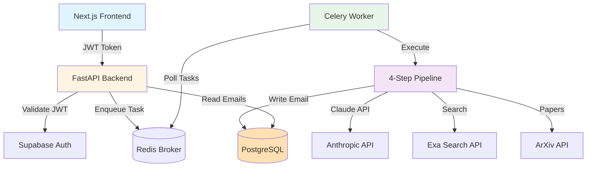

## System Overview

Scribe is a production-ready cold email generation platform built with a **backend-first architecture**. The system uses FastAPI for the REST API, Celery for asynchronous task processing, and a sophisticated 4-step AI pipeline to generate personalized academic outreach emails.

### High-Level Architecture



### Core Components

<CardGroup cols={2}>
  <Card title="FastAPI Backend" icon="server">
    REST API handling authentication, request validation, and database operations
  </Card>
  <Card title="Celery Workers" icon="gears">
    Asynchronous task processing for long-running email generation (10-25s)
  </Card>
  <Card title="PostgreSQL Database" icon="database">
    Stores users, emails, queue items, and templates with JSONB metadata
  </Card>
  <Card title="Redis Cache" icon="memory">
    Task queue broker and result backend with 1-hour TTL
  </Card>
</CardGroup>

---

## Technology Stack

### Backend Framework

| Technology | Version | Purpose |
|------------|---------|----------|
| **FastAPI** | 0.109+ | High-performance ASGI web framework with automatic validation |
| **Python** | 3.13 | Modern Python with native async/await support |
| **Uvicorn** | 0.27+ | Lightning-fast ASGI server implementation |
| **Pydantic** | 2.5+ | Data validation and settings management |

**Why FastAPI?**
- Native `async/await` for concurrent operations
- Automatic Pydantic validation and serialization
- Auto-generated OpenAPI documentation at `/docs`
- Best-in-class performance (comparable to Node.js/Go)
- Type hints throughout for IDE support

### Database Layer

| Technology | Version | Purpose |
|------------|---------|----------|
| **PostgreSQL** | Latest | Primary database via Supabase managed hosting |
| **SQLAlchemy** | 2.0+ | Modern ORM with async support and type hints |
| **Alembic** | 1.13+ | Database migration management |
| **Supabase** | 2.3+ | Managed PostgreSQL with built-in auth |

**Database Configuration:**
- **Connection Mode**: Transaction Pooler (port 6543)
- **Pooling Strategy**: `NullPool` (no client-side pooling)
- **SSL Mode**: Required (`sslmode=require`)
- **Connection String**: Auto-constructed from environment variables

<Note>
  **Why NullPool?** Supabase's transaction pooler (Supavisor) handles connection pooling server-side. NullPool creates fresh connections per request, preventing stale connection issues common with client-side pooling.
</Note>

### Task Queue System

| Technology | Version | Purpose |
|------------|---------|----------|
| **Celery** | 5.3+ | Distributed task queue for async processing |
| **Redis** | 5.0+ | Message broker and result backend |
| **Flower** | 2.0+ | Real-time monitoring UI for Celery |
| **Kombu** | 5.3+ | Messaging library for Celery |

**Why Celery over FastAPI BackgroundTasks?**

| Feature | Celery + Redis | BackgroundTasks |
|---------|----------------|------------------|
| Persistent State | ✅ Redis storage | ❌ In-memory only |
| Status Polling | ✅ `AsyncResult` API | ❌ No polling support |
| Horizontal Scaling | ✅ Multiple workers | ❌ Tied to API process |
| Retry Logic | ✅ Built-in with exponential backoff | ❌ Manual implementation |
| Monitoring | ✅ Flower UI | ❌ No visibility |
| Task Timeouts | ✅ Configurable | ❌ Limited control |

<Warning>
  **Decision Point**: Email generation takes 10-25 seconds — too long for synchronous HTTP requests. Celery provides production-ready async processing with status polling.
</Warning>

### AI & Machine Learning

| Technology | Version | Purpose |
|------------|---------|----------|
| **Anthropic Claude** | Latest | LLM for email generation (Haiku 4.5, Sonnet 4.5) |
| **Pydantic AI** | 1.18+ | Structured LLM outputs with type safety |
| **Exa Search** | 2.0+ | AI-powered web search for recipient research |
| **ArXiv API** | 2.0+ | Academic paper discovery and citation |

**LLM Model Selection** (Hot-Swappable via Environment Variables):

<CodeGroup>
```bash Claude Models (Default)
# Fast extraction
TEMPLATE_PARSER_MODEL=anthropic:claude-haiku-4-5

# High-quality writing
EMAIL_COMPOSER_MODEL=anthropic:claude-sonnet-4-5
```

```bash Fireworks AI (Cost-Optimized)
# Alternative provider
TEMPLATE_PARSER_MODEL=fireworks:accounts/fireworks/models/kimi-k2p5
EMAIL_COMPOSER_MODEL=fireworks:accounts/fireworks/models/kimi-k2p5
```
</CodeGroup>

**Why Claude?**
- Superior instruction-following for structured output
- Fast models (Haiku) for extraction tasks
- Powerful models (Sonnet) for creative writing
- Excellent at chain-of-thought reasoning
- Native JSON mode for Pydantic integration

**Why Exa Search?**
- Modern dual-query strategy (background + publications)
- Better academic content retrieval than Google CSE
- Automatic citation extraction
- AI-powered result ranking

### Web Scraping

| Technology | Version | Purpose |
|------------|---------|----------|
| **Playwright** | 1.56+ | Headless browser for JavaScript-heavy sites |
| **BeautifulSoup4** | 4.12+ | HTML parsing and content extraction |
| **httpx** | 0.27+ | Modern async HTTP client with HTTP/2 |

**Why Playwright?**
- Full JavaScript execution (unlike requests/httpx)
- Handles dynamic content loading
- Supports modern web standards
- Headless mode for server deployment
- ~300MB Chromium binary (cached after first install)

### Observability

| Technology | Version | Purpose |
|------------|---------|----------|
| **Logfire** | 4.14+ | Distributed tracing and LLM monitoring |
| **Pydantic Integration** | Native | Automatic instrumentation |

**Automatic Instrumentation**:
- All FastAPI requests (path, status, duration)
- Database queries (SQLAlchemy)
- Celery tasks (enqueue, start, success, failure)
- LLM calls (prompts, tokens, cost, latency)
- Pipeline steps (distributed tracing)

---

## Backend-First Authentication

Scribe follows a **strict backend-first design** where the frontend only uses Supabase for authentication, and the backend handles all database operations.

### Authentication Flow

<Steps>
  <Step title="Frontend Login">
    User authenticates via Supabase Auth (email/password or OAuth)
  </Step>
  <Step title="JWT Token">
    Supabase returns a JWT token containing `user_id` and `email`
  </Step>
  <Step title="API Request">
    Frontend includes JWT in `Authorization: Bearer <token>` header
  </Step>
  <Step title="Backend Validation">
    FastAPI validates JWT via Supabase and extracts `user_id`
  </Step>
  <Step title="Database Operations">
    Backend performs all database operations using service role key
  </Step>
</Steps>

### Security Model

```python main.py
from api.dependencies import get_current_user
from models.user import User

@app.get("/api/user/profile")
async def get_profile(
    current_user: User = Depends(get_current_user)
):
    # current_user is validated from JWT token
    # user_id is NEVER trusted from request body
    return current_user
```

<Warning>
  **Critical Security Rules:**
  - Frontend uses Supabase **ONLY** for authentication
  - Backend uses service role key for full database access
  - **NEVER** trust `user_id` from request body — always extract from validated JWT
  - All database operations go through FastAPI backend
  - No direct database access from frontend
</Warning>

**Why This Approach?**
- **Security**: Centralized authorization enforcement
- **Flexibility**: Schema changes don't break frontend
- **Business Logic**: Complex validation in one place
- **Auditability**: All database operations logged

---

## The 4-Step Pipeline

The email generation pipeline is a **stateless, in-memory process** that enriches a shared `PipelineData` object through four sequential steps.

### Pipeline Architecture

```
┌─────────────────────┐
│  Template Parser    │  Extracts search terms, classifies template type
│  (~1.2s)            │  Model: Claude Haiku 4.5
└──────────┬──────────┘
           │
           ▼
┌─────────────────────┐
│   Web Scraper       │  Dual-query Exa search + content summarization
│   (~5.3s)           │  Background + Publications
└──────────┬──────────┘
           │
           ▼
┌─────────────────────┐
│  ArXiv Helper       │  Fetch academic papers (RESEARCH type only)
│  (~0.8s)            │  Top 5 papers by relevance
└──────────┬──────────┘
           │
           ▼
┌─────────────────────┐
│  Email Composer     │  Generate final email + write to database
│  (~3.1s)            │  Model: Claude Sonnet 4.5
└─────────────────────┘

Total: ~10-15 seconds
```

### Step 1: Template Parser

**Input**: Template text, recipient info  
**Process**: Claude analyzes template and extracts search terms  
**Output**: `search_terms` (list), `template_type` (RESEARCH/BOOK/GENERAL)  

**Example**:
```python
Input: "Hi {{name}}, I love your work on {{research}}"
Output: {
  "search_terms": ["Jane Smith machine learning", "Jane Smith publications"],
  "template_type": "RESEARCH"
}
```

### Step 2: Web Scraper

**Input**: Search terms, template type  
**Process**: Dual-query Exa search (background + publications), content summarization  
**Output**: `scraped_content` (with citations), `scraped_urls`  

**Dual-Query Strategy**:
1. **Query 1**: Background (affiliations, bio, current work)
2. **Query 2**: Publications (papers/books based on template_type)
3. **Combine**: Merge results with proper citations

### Step 3: ArXiv Helper

**Input**: Recipient name  
**Process**: Search ArXiv API for papers by author  
**Output**: `arxiv_papers` (title, abstract, year, url)  
**Condition**: Only runs if `template_type == RESEARCH`  

**Skipped for**: BOOK and GENERAL templates

### Step 4: Email Composer

**Input**: All gathered data (template, scraped content, papers)  
**Process**: Claude Sonnet generates personalized email  
**Output**: `final_email`, `email_id` (UUID)  
**Database Operations**:
- Insert email into `emails` table
- Increment `user.generation_count`
- Store metadata (papers, sources, timings) in JSONB field

### Pipeline Data Flow

```python pipeline/models/core.py
@dataclass
class PipelineData:
    # Input
    email_template: str
    recipient_name: str
    recipient_interest: str
    user_id: str
    
    # Step 1 output
    search_terms: list[str] | None = None
    template_type: TemplateType | None = None
    
    # Step 2 output
    scraped_content: str | None = None
    scraped_urls: list[str] | None = None
    
    # Step 3 output
    arxiv_papers: list[dict] | None = None
    
    # Step 4 output
    final_email: str | None = None
    email_id: str | None = None
```

<Note>
  **Stateless Design**: `PipelineData` lives entirely in memory during execution. Only the final email is persisted to the database. This design simplifies debugging and reduces database load (1 write instead of 4+).
</Note>

---

## Database Schema

### Users Table

```sql
CREATE TABLE users (
    id UUID PRIMARY KEY,              -- From Supabase auth.users
    email VARCHAR(255) UNIQUE NOT NULL,
    display_name VARCHAR(255),
    generation_count INTEGER DEFAULT 0,
    template_count INTEGER DEFAULT 0,
    onboarded BOOLEAN DEFAULT FALSE,
    email_template TEXT,
    created_at TIMESTAMP NOT NULL DEFAULT NOW()
);

CREATE INDEX ix_users_email ON users(email);
```

### Emails Table

```sql
CREATE TABLE emails (
    id UUID PRIMARY KEY DEFAULT gen_random_uuid(),
    user_id UUID NOT NULL REFERENCES users(id) ON DELETE CASCADE,
    recipient_name VARCHAR(255) NOT NULL,
    recipient_interest VARCHAR(500) NOT NULL,
    email_message TEXT NOT NULL,
    template_type VARCHAR(50) NOT NULL,  -- RESEARCH | BOOK | GENERAL
    metadata JSONB,                      -- Pipeline metadata
    is_confident BOOLEAN DEFAULT TRUE,
    displayed BOOLEAN DEFAULT TRUE,
    created_at TIMESTAMP NOT NULL DEFAULT NOW()
);

CREATE INDEX ix_emails_user_id ON emails(user_id);
CREATE INDEX ix_emails_created_at ON emails(created_at);
CREATE INDEX ix_emails_user_created ON emails(user_id, created_at);
```

**Metadata JSONB Structure**:
```json
{
  "search_terms": ["Dr. Jane Smith machine learning"],
  "scraped_urls": ["https://example.com/profile"],
  "scraping_metadata": {"success_rate": 0.8},
  "arxiv_papers": [
    {
      "title": "Deep Learning for Healthcare",
      "arxiv_url": "https://arxiv.org/abs/1234.5678",
      "year": 2023
    }
  ],
  "step_timings": {
    "template_parser": 1.2,
    "web_scraper": 5.3,
    "arxiv_helper": 0.8,
    "email_composer": 3.1
  },
  "model": "anthropic:claude-sonnet-4-5",
  "temperature": 0.7
}
```

### Queue Items Table

```sql
CREATE TABLE queue_items (
    id UUID PRIMARY KEY DEFAULT gen_random_uuid(),
    user_id UUID NOT NULL REFERENCES users(id) ON DELETE CASCADE,
    recipient_name VARCHAR(255) NOT NULL,
    recipient_interest VARCHAR(500) NOT NULL,
    email_template_text TEXT NOT NULL,
    status VARCHAR(50) NOT NULL,         -- PENDING | PROCESSING | COMPLETED | FAILED
    celery_task_id VARCHAR(255),
    current_step VARCHAR(100),
    email_id UUID REFERENCES emails(id) ON DELETE SET NULL,
    error_message TEXT,
    started_at TIMESTAMP,
    completed_at TIMESTAMP,
    created_at TIMESTAMP NOT NULL DEFAULT NOW()
);

CREATE INDEX ix_queue_items_user_id ON queue_items(user_id);
CREATE INDEX ix_queue_items_status ON queue_items(status);
CREATE INDEX ix_queue_items_created_at ON queue_items(created_at);
CREATE INDEX ix_queue_items_user_status ON queue_items(user_id, status);
```

**Queue Status Enum**:
```python models/queue_item.py
class QueueStatus(str, Enum):
    PENDING = "pending"        # Waiting in queue
    PROCESSING = "processing"  # Currently being processed
    COMPLETED = "completed"    # Successfully finished
    FAILED = "failed"          # Encountered error
```

---

## Deployment Architecture

### Self-Hosted on Raspberry Pi

The production backend runs on a **Raspberry Pi 3B+** with traffic routed through a **Cloudflare Tunnel**, providing a persistent, always-on server without cloud hosting costs.

<CardGroup cols={2}>
  <Card title="Hardware Specs" icon="microchip">
    **Raspberry Pi 3B+**
    - CPU: Quad-core Cortex-A53 @ 1.4GHz
    - RAM: 1GB LPDDR2
    - Network: Gigabit Ethernet + Wi-Fi
    - Storage: Micro-SD
  </Card>
  <Card title="Public Endpoint" icon="globe">
    **https://scribeapi.manitmishra.com**
    - Cloudflare Tunnel (outbound-only)
    - Automatic HTTPS/SSL
    - DDoS protection
    - No port forwarding needed
  </Card>
</CardGroup>

### Cloudflare Tunnel Setup

Cloudflare Tunnel creates a secure connection from the Raspberry Pi to Cloudflare's edge network:

```bash
# Install cloudflared on Raspberry Pi
curl -L https://github.com/cloudflare/cloudflared/releases/latest/download/cloudflared-linux-arm.deb -o cloudflared.deb
sudo dpkg -i cloudflared.deb

# Authenticate
cloudflared tunnel login

# Create tunnel
cloudflared tunnel create scribe-backend

# Route traffic
cloudflared tunnel route dns scribe-backend scribeapi.manitmishra.com

# Run tunnel
cloudflared tunnel --config ~/.cloudflared/config.yml run
```

**Tunnel Configuration** (`~/.cloudflared/config.yml`):
```yaml
tunnel: <tunnel-id>
credentials-file: /home/pi/.cloudflared/<tunnel-id>.json

ingress:
  - hostname: scribeapi.manitmishra.com
    service: http://localhost:8000
  - service: http_status:404
```

### Production Services

**FastAPI Server** (`/etc/systemd/system/scribe-api.service`):
```bash
uvicorn main:app --host 0.0.0.0 --port 8000 --timeout-keep-alive 180
```

**Celery Worker** (`/etc/systemd/system/scribe-worker.service`):
```bash
celery -A celery_config.celery_app worker \
  --loglevel=info \
  --queues=email_default,celery \
  --concurrency=1 \
  --max-tasks-per-child=100
```

**Redis Server**:
```bash
redis-server --daemonize yes --maxmemory 256mb --maxmemory-policy allkeys-lru
```

### Resource Considerations

**Memory Breakdown** (1GB total):
- OS + System: ~200MB
- Python + FastAPI: ~80MB
- Redis: ~30MB
- Celery Worker: ~50MB
- Playwright (active): ~150MB
- Pipeline overhead: ~50MB
- **Remaining**: ~340-440MB headroom

<Warning>
  **Concurrency Limitation**: With 1GB RAM, only `concurrency=1` is viable. Each pipeline execution uses ~400MB (including Playwright browser). For higher throughput, upgrade to Raspberry Pi 4 (4GB) or Pi 5 (8GB).
</Warning>

### Scaling Strategy

| Hardware | RAM | Concurrency | Throughput |
|----------|-----|-------------|------------|
| **Pi 3B+ (Current)** | **1GB** | **1 task** | **~3-4 emails/min** |
| Pi 4 (2GB) | 2GB | 1-2 tasks | ~6-8 emails/min |
| Pi 4 (4GB) | 4GB | 2-3 tasks | ~12-15 emails/min |
| Pi 5 (8GB) | 8GB | 4-6 tasks | ~24-30 emails/min |

**Horizontal Scaling** (Future):
- Add more Raspberry Pis as Celery workers
- Shared Redis instance
- Load-balanced FastAPI instances behind Cloudflare

---

## Observability & Monitoring

### Logfire Integration

Logfire provides distributed tracing across the entire request lifecycle:

```
FastAPI Request [POST /api/email/generate]
├─ JWT Validation [api.dependencies.get_current_user]
├─ Database Query [SELECT * FROM users WHERE id = ...]
├─ Celery Enqueue [generate_email_task]
└─ Return task_id

Celery Task [generate_email_task]
├─ Pipeline Runner [pipeline.core.runner.run]
│   ├─ Template Parser [1.2s]
│   │   └─ pydantic_ai.agent.run [Claude Haiku]
│   ├─ Web Scraper [5.3s]
│   │   ├─ exa_search.dual_query
│   │   └─ pydantic_ai.agent.run [Summarization]
│   ├─ ArXiv Helper [0.8s]
│   │   └─ arxiv_api.search
│   └─ Email Composer [3.1s]
│       ├─ pydantic_ai.agent.run [Claude Sonnet]
│       └─ db.insert_email
└─ Task Complete [SUCCESS]
```

**Metrics Tracked**:
- Step-by-step timings
- LLM token usage and cost
- Database query performance
- API endpoint latency
- Worker queue depth
- Error rates and stack traces

### Flower Monitoring UI

Access real-time Celery monitoring at `http://localhost:5555`:
- Active tasks and worker status
- Task history and success/failure rates
- Worker resource usage (CPU, memory)
- Task routing and queue depth
- Retry and failure logs

---

## Directory Structure

```
/scribe-backend
├── main.py                      # FastAPI application entry point
├── celery_config.py             # Celery task queue configuration
├── alembic.ini                  # Database migration config
│
├── api/
│   ├── dependencies.py          # Auth (get_supabase_user, get_current_user)
│   └── routes/
│       ├── user.py              # User management endpoints
│       ├── email.py             # Email generation endpoints
│       ├── template.py          # Template generation endpoints
│       └── queue.py             # Batch queue management
│
├── models/
│   ├── user.py                  # User SQLAlchemy model
│   ├── email.py                 # Email model with JSONB metadata
│   ├── queue_item.py            # Queue item model
│   └── template.py              # Template model
│
├── schemas/
│   ├── auth.py                  # Authentication request/response
│   ├── pipeline.py              # Email generation schemas
│   ├── template.py              # Template schemas
│   └── queue.py                 # Queue schemas
│
├── pipeline/
│   ├── core/
│   │   └── runner.py            # BasePipelineStep, PipelineRunner
│   ├── models/
│   │   └── core.py              # PipelineData, StepResult, TemplateType
│   └── steps/
│       ├── template_parser/     # Step 1: Template analysis
│       ├── web_scraper/         # Step 2: Web scraping + summarization
│       ├── arxiv_helper/        # Step 3: Academic paper fetching
│       └── email_composer/      # Step 4: Email generation + DB write
│
├── tasks/
│   └── email_tasks.py           # Celery task definitions
│
├── database/
│   ├── base.py                  # SQLAlchemy engine and Base
│   ├── session.py               # Session management
│   ├── dependencies.py          # Database dependencies
│   └── utils.py                 # Health checks, retry logic
│
├── config/
│   └── settings.py              # Pydantic Settings (environment config)
│
├── services/
│   ├── supabase.py              # Supabase client singleton
│   └── template_generator.py   # AI template generation from resume
│
├── observability/
│   └── logfire_config.py        # Logfire initialization
│
└── alembic/
    └── versions/                # Database migration files
```

---

## Key Architectural Decisions

### 1. Stateless Pipeline Design

**Philosophy**: Pipeline state lives in `PipelineData` object in memory. No intermediate database writes—only the final email is persisted.

**Benefits**:
- Simplified debugging (full trace in Logfire)
- Reduced database load (1 write instead of 4+)
- Idempotent retries (no partial state corruption)
- Better performance (all processing in RAM)

**Trade-offs**:
- Cannot resume mid-pipeline (must restart from Step 1)
- Acceptable because tasks only take 10-25s

### 2. Backend-First (No Direct DB Access)

**Why**: Security (enforce authorization), flexibility (schema changes don't break frontend), centralized business logic

**Trade-off**: Extra API latency vs direct Supabase client queries (acceptable for ~50ms overhead)

### 3. Transaction Pooler with NullPool

**Why**: Supabase's Supavisor handles connection pooling server-side. Client-side pooling causes stale connection issues.

**How**: NullPool creates fresh connections per request, immediately discarded after use.

**Benefit**: Optimal for single-server deployments (Raspberry Pi). Eliminates connection management complexity.

### 4. Memory-Constrained Design

**Context**: Raspberry Pi 3B+ has only 1GB RAM

**Solution**: Sequential processing (`concurrency=1`), single worker, aggressive memory management

**Measurement**: Each task uses ~400MB with Playwright browser

**Future**: With 4GB+ RAM → increase concurrency to 2-4

### 5. Hot-Swappable LLM Models

**Implementation**: Environment variables control model selection

**Current Defaults**:
```bash
TEMPLATE_PARSER_MODEL=fireworks:accounts/fireworks/models/kimi-k2p5
EMAIL_COMPOSER_MODEL=fireworks:accounts/fireworks/models/kimi-k2p5
```

**Benefit**: Switch providers without code changes (cost optimization, A/B testing)

---

## Common Troubleshooting

| Problem | Solution |
|---------|----------|
| Worker not picking up tasks | Check Redis: `redis-cli ping`, restart worker |
| Task stuck in PENDING | Verify worker running: `celery -A celery_config.celery_app inspect active` |
| Out of memory (OOM) | Reduce `worker_concurrency` to 1, restart worker |
| Database connection errors | Check `.env`, verify Supabase credentials and port 6543 |
| Playwright fails | Reinstall: `playwright install chromium` |
| Stale database connections | Using NullPool should prevent this; check connection string |

---

## Further Reading

<CardGroup cols={2}>
  <Card title="Quickstart Guide" icon="rocket" href="/get-started/quickstart">
    Get Scribe running locally in 5 minutes
  </Card>
  <Card title="API Reference" icon="code" href="/api-reference">
    Complete REST API documentation
  </Card>
  <Card title="Pipeline Deep Dive" icon="gears" href="/pipeline">
    Detailed implementation of the 4-step pipeline
  </Card>
  <Card title="Development Guide" icon="wrench" href="/development">
    Testing workflows and debugging techniques
  </Card>
</CardGroup>