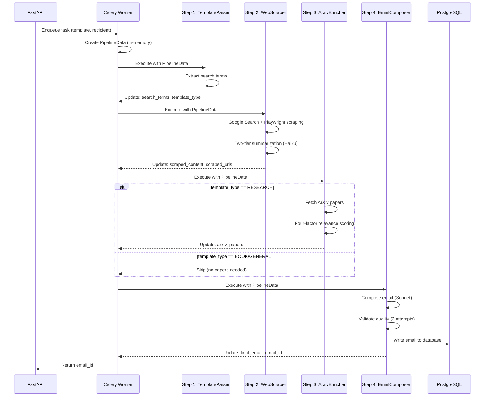

## Overview

Scribe's email generation system uses a stateless, in-memory pipeline that transforms a template into a personalized email through **4 sequential steps**:

1. **Template Parser** - Analyze template and extract search terms
2. **Web Scraper** - Fetch and summarize relevant information
3. **ArXiv Enricher** - Conditionally fetch academic papers
4. **Email Composer** - Generate final email and persist to database

<Info>
  **Execution Time**: 10-25 seconds depending on template complexity and web content availability.
</Info>

## PipelineData Structure

All pipeline state lives in a single `PipelineData` dataclass passed through each step. **No intermediate database writes** occur—only the final email is persisted.

```python pipeline/models/core.py
@dataclass
class PipelineData:
    """
    In-memory state passed between pipeline steps. Not persisted to database.
    
    Only the final email is written to DB by EmailComposer.
    """

    # Input data (set by Celery task from API request)
    task_id: str
    """Celery task ID - used for correlation in Logfire"""

    user_id: str
    """User ID from JWT token - for database writes"""

    email_template: str
    """Template string with placeholders like {{name}}, {{research}}"""

    recipient_name: str
    """Full name of professor/recipient (e.g., 'Dr. Jane Smith')"""

    recipient_interest: str
    """Research area or interest (e.g., 'machine learning')"""

    # Step 1 outputs (TemplateParser)
    search_terms: List[str] = field(default_factory=list)
    template_type: TemplateType | None = None
    template_analysis: Dict[str, Any] = field(default_factory=dict)

    # Step 2 outputs (WebScraper)
    scraped_content: str = ""
    scraped_urls: List[str] = field(default_factory=list)
    scraping_metadata: Dict[str, Any] = field(default_factory=dict)

    # Step 3 outputs (ArxivEnricher)
    arxiv_papers: List[Dict[str, Any]] = field(default_factory=list)
    enrichment_metadata: Dict[str, Any] = field(default_factory=dict)

    # Step 4 outputs (EmailComposer)
    final_email: str = ""
    composition_metadata: Dict[str, Any] = field(default_factory=dict)
    is_confident: bool = False

    # Metadata (for final DB write)
    metadata: Dict[str, Any] = field(default_factory=dict)
```

### Why Dataclass over Pydantic?

- **Lighter weight**: No validation overhead during execution
- **Faster instantiation**: Critical for high-throughput processing
- **Validation only at boundaries**: API requests/responses use Pydantic

## Helper Methods

The `PipelineData` class includes utility methods for tracking execution:

```python pipeline/models/core.py
def total_duration(self) -> float:
    """Calculate total pipeline execution time in seconds"""
    return (datetime.utcnow() - self.started_at).total_seconds()

def add_timing(self, step_name: str, duration: float) -> None:
    """Record step timing"""
    self.step_timings[step_name] = duration

def add_error(self, step_name: str, error_message: str) -> None:
    """Record non-fatal error"""
    self.errors.append(f"{step_name}: {error_message}")
```

## StepResult

Each pipeline step returns a `StepResult` to indicate success or failure:

```python pipeline/models/core.py
@dataclass
class StepResult:
    """
    Result of a pipeline step execution.
    
    Returned by BasePipelineStep.execute() to indicate success/failure.
    """

    success: bool
    """Whether the step completed successfully"""

    step_name: str
    """Name of the step that produced this result"""

    error: Optional[str] = None
    """Error message if success=False"""

    metadata: Optional[Dict[str, Any]] = None
    """
    Optional metadata about execution:
    - duration: float (seconds)
    - output_size: int (bytes/chars)
    - api_calls_made: int
    - retries_attempted: int
    """

    warnings: List[str] = field(default_factory=list)
    """Non-fatal warnings (e.g., 'some URLs failed to scrape')"""
```

<Warning>
  If `success=False`, the `error` field **must** be set. The `__post_init__` method validates this constraint.
</Warning>

## Data Flow



## Performance Characteristics

### Execution Time Breakdown

| Step | Avg Time | Variance | Bottleneck |
|------|----------|----------|------------|
| Template Parser | 1.2s | Low | LLM API call |
| Web Scraper | 5.3s | High | Playwright rendering |
| ArXiv Enricher | 0.8s | Low | ArXiv API response |
| Email Composer | 3.1s | Medium | LLM generation + validation |
| **Total** | **10.4s** | Medium | Network + LLM latency |

<Note>
  **Variance Factors**: Web Scraper time depends on website complexity and JavaScript load time. Email Composer validation retries can add 2-6s.
</Note>

### Memory Usage (512MB RAM Deployment)

```
Base Python + FastAPI:        ~80MB
Playwright Chromium:          ~150MB (when active)
Pipeline overhead:            ~50MB
LLM response caching:         ~30MB
Available buffer:             ~200MB
──────────────────────────────────
Total peak usage:             ~310MB (safe margin)
```

**Memory Optimizations**:
- Sequential scraping (not parallel) to limit browser instances
- Smart chunking to avoid loading full content in memory
- No intermediate database writes

## Error Handling

### Error Categories

<AccordionGroup>
  <Accordion title="Fatal Errors (stop pipeline)">
    - Template Parser fails (can't proceed without search terms)
    - Email Composer database write fails
    - Invalid input data (Pydantic validation)
  </Accordion>

  <Accordion title="Non-Fatal Errors (continue with degraded service)">
    - Some URLs fail to scrape (continue with successful ones)
    - ArXiv API timeout (continue without papers)
    - Email validation warnings (still persist email)
  </Accordion>
</AccordionGroup>

### Retry Strategy

Celery tasks automatically retry on transient failures:

- **Max Retries**: 3 attempts
- **Backoff**: 60s, 120s, fail permanently
- **Retriable**: External API failures, database connection errors, network timeouts
- **Non-Retriable**: Invalid input data, user not found, quota exceeded

## Related Concepts

<CardGroup cols={2}>
  <Card title="Template Types" icon="tags" href="/concepts/template-types">
    Learn about RESEARCH, BOOK, and GENERAL template classification
  </Card>
  <Card title="Queue System" icon="list-check" href="/concepts/queue-system">
    Understand how batch processing and job status tracking work
  </Card>
  <Card title="Authentication" icon="lock" href="/concepts/authentication">
    See how JWT validation protects pipeline execution
  </Card>
</CardGroup>