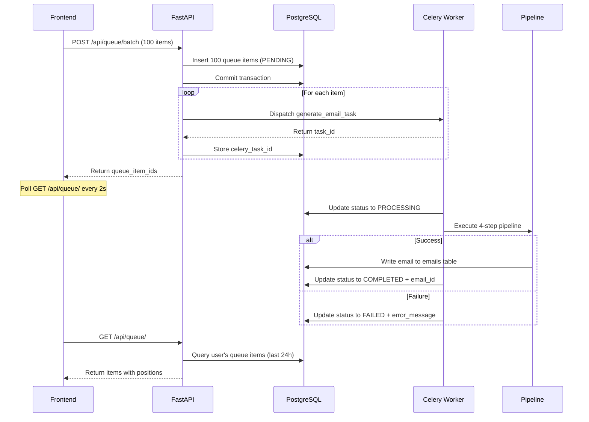
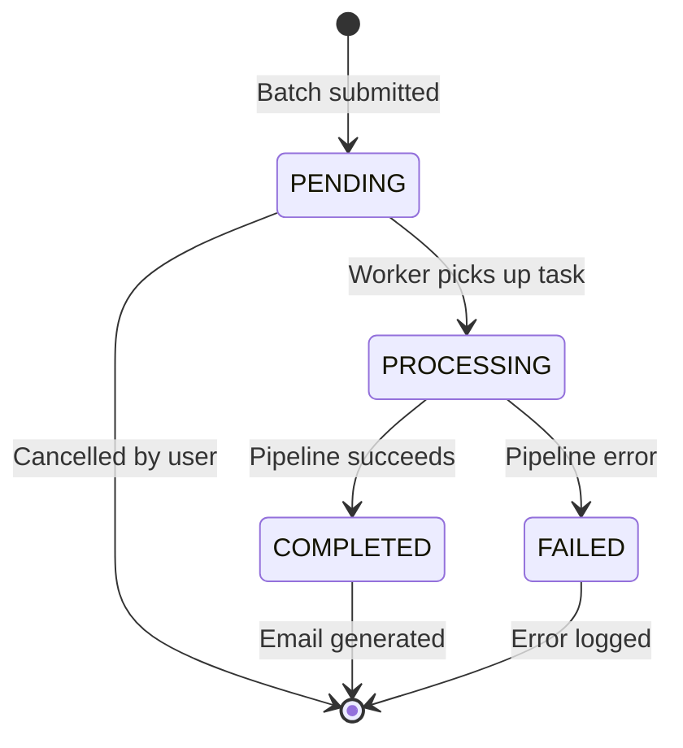

## Overview

Scribe uses a **database-backed queue system** for email generation, allowing users to submit batches of up to 100 emails that are processed sequentially by Celery workers.

<Info>
  **Key Features**: Persistent queue (survives restarts), sequential processing (prevents API rate limits), real-time status updates, 24-hour history.
</Info>

## Queue Architecture



## QueueStatus Enum

The queue item status uses a string-based enum for type safety and JSON serialization:

```python models/queue_item.py
class QueueStatus(str, Enum):
    """Queue item status enum. Inherits from str for JSON serialization."""
    PENDING = "pending"
    PROCESSING = "processing"
    COMPLETED = "completed"
    FAILED = "failed"
```

<Note>
  Inheriting from both `str` and `Enum` allows direct JSON serialization and type-safe comparisons: `item.status == QueueStatus.PENDING`
</Note>

## QueueItem Model

The database model tracks the full lifecycle of each email generation request:

```python models/queue_item.py
class QueueItem(Base):
    """Queue item for sequential email generation. Owned by User, produces Email on completion."""

    __tablename__ = "queue_items"

    # Primary Key
    id = Column(
        PG_UUID(as_uuid=True),
        primary_key=True,
        default=uuid4,
        nullable=False,
        comment="Unique queue item ID"
    )

    # Foreign Key to User
    user_id = Column(
        PG_UUID(as_uuid=True),
        ForeignKey("users.id", ondelete="CASCADE"),
        nullable=False,
        comment="User who submitted this queue item"
    )

    # Request data (snapshot at submission time)
    recipient_name = Column(
        String(255),
        nullable=False,
        comment="Name of the email recipient"
    )

    recipient_interest = Column(
        Text,
        nullable=False,
        comment="Research interest for personalization"
    )

    email_template = Column(
        Text,
        nullable=False,
        comment="Email template snapshot at submission time"
    )

    # Status tracking
    status = Column(
        String(20),
        nullable=False,
        default=QueueStatus.PENDING,
        comment="Current status: pending, processing, completed, failed"
    )

    celery_task_id = Column(
        String(255),
        nullable=True,
        comment="Celery task ID for status polling fallback"
    )

    # Result data
    email_id = Column(
        PG_UUID(as_uuid=True),
        ForeignKey("emails.id", ondelete="SET NULL"),
        nullable=True,
        comment="Generated email ID on successful completion"
    )

    error_message = Column(
        Text,
        nullable=True,
        comment="Error details if status is failed"
    )

    # Pipeline progress (for detailed UI updates)
    current_step = Column(
        String(50),
        nullable=True,
        comment="Current pipeline step: template_parser, web_scraper, arxiv_helper, email_composer"
    )

    # Timestamps
    created_at = Column(
        DateTime(timezone=True),
        nullable=False,
        server_default=func.now(),
        comment="When the item was submitted to queue"
    )

    started_at = Column(
        DateTime(timezone=True),
        nullable=True,
        comment="When processing started"
    )

    completed_at = Column(
        DateTime(timezone=True),
        nullable=True,
        comment="When processing completed or failed"
    )
```

### Database Indexes

Optimized indexes for efficient queue queries:

```python models/queue_item.py
__table_args__ = (
    Index('ix_queue_items_user_id', 'user_id'),
    Index('ix_queue_items_status', 'status'),
    Index('ix_queue_items_created_at', 'created_at', postgresql_using='btree'),
    Index('ix_queue_items_user_status', 'user_id', 'status'),  # Composite index
)
```

## Batch Submission

Submit up to 100 email generation requests in a single API call:

```python api/routes/queue.py
@router.post("/batch", response_model=BatchSubmitResponse, status_code=status.HTTP_201_CREATED)
async def submit_batch(
    batch_request: BatchSubmitRequest,
    current_user: User = Depends(get_current_user),
    db: Session = Depends(get_db),
):
    """
    Submit multiple items to the queue. All items will be processed sequentially.
    """
    with logfire.span(
        "api.queue_batch_submit",
        user_id=str(current_user.id),
        item_count=len(batch_request.items)
    ):
        if len(batch_request.items) > 100:
            raise HTTPException(
                status_code=status.HTTP_400_BAD_REQUEST,
                detail="Maximum 100 items per batch"
            )

        # Phase 1: Create all queue items in the database first
        queue_items = []

        for item in batch_request.items:
            queue_item = QueueItem(
                user_id=current_user.id,
                recipient_name=item.recipient_name,
                recipient_interest=item.recipient_interest,
                email_template=batch_request.email_template,
                status=QueueStatus.PENDING,
            )
            db.add(queue_item)
            queue_items.append((queue_item, item))

        db.flush()  # Assign IDs to all items
        db.commit()  # Commit so items are visible to Celery workers

        # Phase 2: Dispatch Celery tasks now that queue items exist in the DB
        queue_item_ids = []

        for queue_item, item in queue_items:
            task = generate_email_task.apply_async(
                kwargs={
                    "queue_item_id": str(queue_item.id),
                    "user_id": str(current_user.id),
                    "email_template": batch_request.email_template,
                    "recipient_name": item.recipient_name,
                    "recipient_interest": item.recipient_interest,
                },
                queue="email_default"
            )

            queue_item.celery_task_id = task.id
            queue_item_ids.append(str(queue_item.id))

        db.commit()  # Persist celery_task_id references

        logfire.info(
            "Batch submitted to queue",
            user_id=str(current_user.id),
            item_count=len(batch_request.items),
            queue_item_ids=queue_item_ids
        )

        return BatchSubmitResponse(
            queue_item_ids=queue_item_ids,
            message=f"Successfully queued {len(batch_request.items)} items"
        )
```

<Warning>
  **Two-Phase Commit**: Queue items are inserted to the database **before** Celery tasks are dispatched. This ensures tasks always reference valid database records.
</Warning>

## Queue Position Calculation

Efficiently calculate queue positions using SQL window functions (avoids N+1 queries):

```python api/routes/queue.py
@router.get("/", response_model=List[QueueItemResponse])
async def get_queue_items(
    current_user: User = Depends(get_current_user),
    db: Session = Depends(get_db),
):
    """Get queue items from the last 24 hours for the current user with their status and position."""
    with logfire.span(
        "api.queue_get_items",
        user_id=str(current_user.id)
    ):
        # Calculate 24-hour cutoff time (only show recent items)
        cutoff_time = datetime.now(timezone.utc) - timedelta(hours=24)

        # Get all user's queue items ordered by creation time
        items = db.query(QueueItem).filter(
            QueueItem.user_id == current_user.id,
            QueueItem.created_at >= cutoff_time
        ).order_by(QueueItem.created_at.asc()).all()

        # Calculate positions for PENDING items in a single query using window function
        # This avoids N+1 query problem (1 query instead of N queries)

        positions_query = db.query(
            QueueItem.id,
            func.row_number().over(
                order_by=QueueItem.created_at.asc()
            ).label('position')
        ).filter(
            QueueItem.status == QueueStatus.PENDING,
            QueueItem.created_at >= cutoff_time
        ).all()

        # Create lookup map: {item_id: position}
        position_map = {str(item_id): position for item_id, position in positions_query}

        # Build response using the position map
        result = []
        for item in items:
            position = None
            if item.status == QueueStatus.PENDING:
                position = position_map.get(str(item.id))

            result.append(QueueItemResponse(
                id=str(item.id),
                recipient_name=item.recipient_name,
                status=item.status,
                position=position,
                email_id=str(item.email_id) if item.email_id else None,
                error_message=item.error_message,
                current_step=item.current_step,
                created_at=item.created_at,
            ))

        return result
```

<Tip>
  **Performance**: Using `ROW_NUMBER()` window function calculates all positions in a single database query, regardless of queue size. This is **O(1)** instead of **O(N)** queries.
</Tip>

## Cancel Queue Item

Cancel a pending queue item (cannot cancel already processing or completed items):

```python api/routes/queue.py
@router.delete("/{queue_item_id}", response_model=CancelQueueItemResponse)
async def cancel_queue_item(
    queue_item_id: str,
    current_user: User = Depends(get_current_user),
    db: Session = Depends(get_db),
):
    """Cancel a pending queue item. Cannot cancel processing/completed items."""
    # Validate UUID format
    try:
        item_uuid = ensure_uuid(queue_item_id)
    except ValueError as e:
        raise HTTPException(
            status_code=status.HTTP_400_BAD_REQUEST,
            detail=f"Invalid queue item ID format: {str(e)}"
        )

    with logfire.span(
        "api.queue_cancel_item",
        queue_item_id=queue_item_id,
        user_id=str(current_user.id)
    ):
        item = db.query(QueueItem).filter(
            QueueItem.id == item_uuid,
            QueueItem.user_id == current_user.id,
        ).first()

        if not item:
            raise HTTPException(
                status_code=status.HTTP_404_NOT_FOUND,
                detail="Queue item not found"
            )

        if item.status != QueueStatus.PENDING:
            raise HTTPException(
                status_code=status.HTTP_400_BAD_REQUEST,
                detail=f"Cannot cancel item with status '{item.status}'"
            )

        # Revoke the Celery task (terminate=False for graceful handling)
        if item.celery_task_id:
            celery_app.control.revoke(item.celery_task_id, terminate=False)

        # Delete from database
        db.delete(item)
        db.commit()

        logfire.info(
            "Queue item cancelled",
            queue_item_id=queue_item_id,
            user_id=str(current_user.id)
        )

        return CancelQueueItemResponse(message="Queue item cancelled")
```

<Note>
  Celery tasks are revoked with `terminate=False` for graceful shutdown. The task will stop before processing begins but won't be forcibly killed mid-execution.
</Note>

## Request/Response Schemas

### BatchSubmitRequest

```python schemas/queue.py
class BatchSubmitRequest(BaseModel):
    """Request body for POST /api/queue/batch"""
    
    email_template: str = Field(
        ...,
        min_length=10,
        max_length=5000,
        description="Email template with placeholders"
    )
    
    items: List[QueueItemInput] = Field(
        ...,
        min_items=1,
        max_items=100,
        description="Batch of recipients (max 100)"
    )

class QueueItemInput(BaseModel):
    """Individual item in batch submission"""
    
    recipient_name: str = Field(
        ...,
        min_length=2,
        max_length=255,
        description="Recipient name (2-255 chars)"
    )
    
    recipient_interest: str = Field(
        ...,
        min_length=2,
        max_length=500,
        description="Research interest (2-500 chars)"
    )
```

### QueueItemResponse

```python schemas/queue.py
class QueueItemResponse(BaseModel):
    """Response for GET /api/queue/"""
    
    id: str
    recipient_name: str
    status: QueueStatus
    position: int | None = Field(
        None,
        description="Position in queue (only for PENDING items)"
    )
    email_id: str | None = Field(
        None,
        description="Generated email ID (only for COMPLETED items)"
    )
    error_message: str | None = Field(
        None,
        description="Error details (only for FAILED items)"
    )
    current_step: str | None = Field(
        None,
        description="Current pipeline step (only for PROCESSING items)"
    )
    created_at: datetime
```

## Sequential Processing

Celery workers run with `concurrency=1` to process emails sequentially:

```bash
celery -A celery_config worker \
  --loglevel=info \
  --concurrency=1 \
  --queue=email_default
```

**Why Sequential?**
- **API Rate Limits**: Prevents overwhelming external APIs (Google Search, Anthropic)
- **Memory Constraints**: Single Playwright instance fits in 512MB RAM
- **Cost Control**: Predictable API usage patterns

<Info>
  For high-throughput scenarios with sufficient resources, increase concurrency to 2-4 workers. Monitor memory usage and API rate limits carefully.
</Info>

## Status Lifecycle



## Error Handling

### Truncated Error Messages

Error messages are truncated to 1000 characters to prevent database bloat:

```python tasks/email_tasks.py
def update_queue_status(
    queue_item_id: str,
    status: str,
    error_message: str | None = None,
    **kwargs
):
    """Helper to update queue item status in database."""
    with SessionLocal() as db:
        queue_item = db.query(QueueItem).filter(
            QueueItem.id == queue_item_id
        ).first()

        if error_message:
            queue_item.error_message = error_message[:1000]  # Truncate
        
        queue_item.status = status
        db.commit()
```

### Retry Strategy

Celery automatically retries failed tasks:

- **Max Retries**: 3 attempts
- **Backoff**: 60s, 120s, fail permanently
- **Retriable Errors**: Network timeouts, temporary API failures
- **Non-Retriable**: Invalid input, user not found, quota exceeded

## Related Concepts

<CardGroup cols={2}>
  <Card title="Pipeline Architecture" icon="diagram-project" href="/concepts/pipeline">
    Understand the 4-step email generation process
  </Card>
  <Card title="Job Status" icon="spinner" href="/concepts/template-types">
    Learn about PENDING, RUNNING, COMPLETED, and FAILED states
  </Card>
  <Card title="Authentication" icon="lock" href="/concepts/authentication">
    See how user_id associates queue items with authenticated users
  </Card>
</CardGroup>