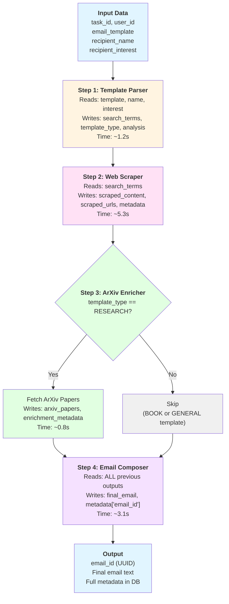

The `PipelineData` dataclass is the **single source of truth** during pipeline execution. Each step reads from previous step outputs and writes to specific fields.

## PipelineData Structure

The full dataclass with field-level documentation:

```python pipeline/models/core.py
from dataclasses import dataclass, field
from datetime import datetime
from typing import Dict, List, Any, Optional

@dataclass
class PipelineData:
    """In-memory state passed between pipeline steps. Not persisted to database."""
    
    # ===== INPUT DATA (from API request) =====
    task_id: str
    """Celery task ID - used for correlation in Logfire"""
    
    user_id: str
    """User ID from JWT token - for database writes"""
    
    email_template: str
    """Template string with placeholders like {{name}}, {{research}}"""
    
    recipient_name: str
    """Full name of professor/recipient (e.g., 'Dr. Jane Smith')"""
    
    recipient_interest: str
    """Research area or interest (e.g., 'machine learning')"""
    
    # ===== STEP 1 OUTPUTS (TemplateParser) =====
    search_terms: List[str] = field(default_factory=list)
    """
    Search queries extracted from template and recipient info.
    Example: ["Dr. Jane Smith machine learning", "Jane Smith publications"]
    """
    
    template_type: TemplateType | None = None
    """Required after Step 1 - set by TemplateParser (RESEARCH, BOOK, GENERAL)"""
    
    template_analysis: Dict[str, Any] = field(default_factory=dict)
    """
    Required after Step 1 - parsing details (placeholders, tone, etc.).
    Always present after TemplateParser.
    """
    
    # ===== STEP 2 OUTPUTS (WebScraper) =====
    scraped_content: str = ""
    """
    Cleaned and summarized content from web scraping.
    Limited to ~3000 chars to avoid LLM context limits.
    """
    
    scraped_urls: List[str] = field(default_factory=list)
    """URLs that were successfully scraped"""
    
    scraped_page_contents: Dict[str, str] = field(default_factory=dict)
    """Mapping of URL -> raw cleaned content (per page)."""
    
    scraping_metadata: Dict[str, Any] = field(default_factory=dict)
    """
    Scraping stats: total_urls_tried, successful_scrapes, failed_urls
    """
    
    # ===== STEP 3 OUTPUTS (ArxivEnricher) =====
    arxiv_papers: List[Dict[str, Any]] = field(default_factory=list)
    """
    Papers fetched from ArXiv API (only if template_type == RESEARCH).
    Each dict has: {title, abstract, year, url, authors}
    Limited to top 5 most relevant papers.
    """
    
    enrichment_metadata: Dict[str, Any] = field(default_factory=dict)
    """
    Enrichment stats: papers_found, search metadata
    """
    
    # ===== STEP 4 OUTPUTS (EmailComposer) =====
    final_email: str = ""
    """
    Final composed email (ready to send).
    Set by EmailComposer step.
    """
    
    composition_metadata: Dict[str, Any] = field(default_factory=dict)
    """
    Composition stats: llm_tokens_used, validation_attempts, quality_score
    """
    
    is_confident: bool = False
    """
    Whether the email composer had sufficient context to write a
    quality personalized email (vs generic fallback).
    """
    
    # ===== METADATA (for final DB write) =====
    metadata: Dict[str, Any] = field(default_factory=dict)
    """
    Metadata that will be stored in emails.metadata JSONB column.
    EmailComposer populates this before DB write.
    """
    
    # ===== TRANSIENT DATA (logged to Logfire, not persisted) =====
    started_at: datetime = field(default_factory=datetime.utcnow)
    """Pipeline start time"""
    
    step_timings: Dict[str, float] = field(default_factory=dict)
    """
    Duration of each step in seconds.
    Example: {"template_parser": 1.2, "web_scraper": 3.5, ...}
    """
    
    errors: List[str] = field(default_factory=list)
    """
    Non-fatal errors encountered during execution.
    Fatal errors raise exceptions and terminate pipeline.
    """
    
    # ===== HELPER METHODS =====
    def total_duration(self) -> float:
        """Calculate total pipeline execution time in seconds"""
        return (datetime.utcnow() - self.started_at).total_seconds()
    
    def add_timing(self, step_name: str, duration: float) -> None:
        """Record step timing"""
        self.step_timings[step_name] = duration
    
    def add_error(self, step_name: str, error_message: str) -> None:
        """Record non-fatal error"""
        self.errors.append(f"{step_name}: {error_message}")
```

## Data Flow by Step

### Step 1: Template Parser

**Reads**:
- `email_template` - Template with placeholders
- `recipient_name` - Recipient's full name
- `recipient_interest` - Research area/interest

**Writes**:
- `search_terms` - List of search queries for web scraping
- `template_type` - RESEARCH | BOOK | GENERAL classification
- `template_analysis` - Detailed parsing results (placeholders, tone, etc.)

**Example Output**:
```python
pipeline_data.search_terms = [
    "Dr. Jane Smith machine learning healthcare",
    "Jane Smith publications",
    "Jane Smith research papers"
]
pipeline_data.template_type = TemplateType.RESEARCH
pipeline_data.template_analysis = {
    "placeholders": ["name", "research"],
    "tone": "professional",
    "confidence": 0.95
}
```

**Validation Requirements**:
<Check>Template type must be set (RESEARCH, BOOK, or GENERAL)</Check>
<Check>At least 1 search term extracted</Check>
<Check>Template analysis contains placeholder information</Check>

---

### Step 2: Web Scraper

**Reads**:
- `search_terms` - Queries generated by Template Parser
- `recipient_name` - For relevance filtering
- `recipient_interest` - For relevance filtering

**Writes**:
- `scraped_content` - Summarized content (max 3000 chars)
- `scraped_urls` - List of successfully scraped URLs
- `scraped_page_contents` - Raw content per URL (for debugging)
- `scraping_metadata` - Stats about scraping success/failure

**Example Output**:
```python
pipeline_data.scraped_content = """
Dr. Jane Smith is an Associate Professor at Stanford University specializing 
in machine learning applications for healthcare. Her recent work focuses on 
using deep learning for medical image analysis. She has published over 30 papers 
in top-tier conferences including NeurIPS and ICML. [PAGE 1]

Her lab's latest project involves developing AI models for early cancer detection 
from CT scans, achieving 95% accuracy. [PAGE 2]
"""

pipeline_data.scraped_urls = [
    "https://profiles.stanford.edu/jane-smith",
    "https://scholar.google.com/citations?user=abc123"
]

pipeline_data.scraping_metadata = {
    "total_urls_tried": 6,
    "successful_scrapes": 2,
    "failed_urls": 4,
    "summarization_method": "two_tier"  # or "direct"
}
```

**Validation Requirements**:
<Check>Scraped content not empty (at least 100 chars)</Check>
<Check>At least 1 URL successfully scraped</Check>
<Check>Content sanitized (no HTML tags, scripts, or excessive whitespace)</Check>

---

### Step 3: ArXiv Enricher

**Reads**:
- `template_type` - Only runs if RESEARCH type
- `recipient_name` - For ArXiv author search
- `recipient_interest` - For keyword-based search
- `scraped_content` - For additional context

**Writes**:
- `arxiv_papers` - List of relevant papers (top 5)
- `enrichment_metadata` - Stats about paper fetching

**Conditional Execution**:
```python
if pipeline_data.template_type == TemplateType.RESEARCH:
    # Fetch papers from ArXiv
    pass
else:
    # Skip this step (BOOK or GENERAL template)
    return StepResult(success=True, step_name="arxiv_enricher", 
                     warnings=["Skipped (not RESEARCH template)"])
```

**Example Output**:
```python
pipeline_data.arxiv_papers = [
    {
        "title": "Deep Learning for Medical Image Segmentation",
        "abstract": "We propose a novel architecture for...",
        "year": 2023,
        "url": "https://arxiv.org/abs/2301.12345",
        "authors": ["Jane Smith", "John Doe"],
        "relevance_score": 0.92
    },
    # ... up to 5 papers
]

pipeline_data.enrichment_metadata = {
    "papers_found": 15,
    "papers_returned": 5,
    "search_queries": ["Jane Smith", "machine learning healthcare"],
    "api_response_time": 0.8
}
```

**Validation Requirements**:
<Check>If RESEARCH template and papers found, return at least 1 paper</Check>
<Check>Each paper must have title, abstract, url, authors fields</Check>
<Check>Non-fatal error if ArXiv API fails (pipeline continues without papers)</Check>

---

### Step 4: Email Composer

**Reads** (ALL previous step outputs):
- `email_template` - Original template
- `recipient_name` - Recipient's name
- `recipient_interest` - Research interest
- `scraped_content` - Web scraping summary
- `arxiv_papers` - Academic papers (if available)
- `template_type` - Template classification
- `template_analysis` - Placeholder information

**Writes**:
- `final_email` - Generated email text
- `composition_metadata` - Generation stats
- `is_confident` - Quality confidence flag
- `metadata` - Final metadata for database (includes `email_id`)

**Example Output**:
```python
pipeline_data.final_email = """
Dear Dr. Smith,

I recently came across your work on deep learning for medical image analysis, 
particularly your 2023 paper "Deep Learning for Medical Image Segmentation" 
published on arXiv. Your approach to using attention mechanisms for CT scan 
analysis is highly relevant to my research.

I'm currently working on...

Best regards,
John Doe
"""

pipeline_data.composition_metadata = {
    "llm_tokens_used": 1500,
    "validation_attempts": 1,  # First attempt passed
    "quality_score": 0.87,
    "model": "claude-sonnet-4-5-20250929",
    "temperature": 0.7
}

pipeline_data.is_confident = True  # Had sufficient context

pipeline_data.metadata = {
    "email_id": "123e4567-e89b-12d3-a456-426614174000",  # Set after DB write
    "search_terms": pipeline_data.search_terms,
    "scraped_urls": pipeline_data.scraped_urls,
    "arxiv_papers": [
        {"title": "...", "url": "..."}
        # Simplified paper info for DB storage
    ],
    "step_timings": pipeline_data.step_timings,
    "generation_time": 10.4
}
```

**Validation Requirements**:
<Check>Final email not empty (at least 50 chars)</Check>
<Check>Recipient name appears in email</Check>
<Check>No unfilled placeholders (double braces, brackets, [INSERT, etc.)</Check>
<Check>If RESEARCH template, at least one paper mentioned (warning if not)</Check>
<Check>Email_id set in metadata after database write</Check>

---

## Metadata Collection

Metadata is collected throughout the pipeline and stored in the final database record:

<AccordionGroup>
  <Accordion title="Step Timings">
    Automatically collected by `BasePipelineStep.execute()` method:
    
    ```python
    pipeline_data.step_timings = {
        "template_parser": 1.2,
        "web_scraper": 5.3,
        "arxiv_enricher": 0.8,
        "email_composer": 3.1
    }
    ```
    
    Used for:
    - Performance monitoring
    - Identifying slow steps
    - Capacity planning
  </Accordion>
  
  <Accordion title="Error Tracking">
    Non-fatal errors recorded via `pipeline_data.add_error()`:
    
    ```python
    pipeline_data.errors = [
        "web_scraper: Failed to scrape 2 URLs (timeout)",
        "email_composer: Validation failed on attempt 1 (missing paper mention)"
    ]
    ```
    
    Used for:
    - Debugging quality issues
    - Identifying flaky external APIs
    - User support (explaining why email may be generic)
  </Accordion>
  
  <Accordion title="Content Sources">
    Tracks where information came from:
    
    ```python
    pipeline_data.metadata = {
        "search_terms": ["Dr. Jane Smith machine learning"],
        "scraped_urls": ["https://profiles.stanford.edu/jane-smith"],
        "arxiv_papers": [
            {
                "title": "Deep Learning for Medical Image Segmentation",
                "url": "https://arxiv.org/abs/2301.12345"
            }
        ]
    }
    ```
    
    Used for:
    - Citation verification
    - Quality auditing
    - User transparency (showing sources)
  </Accordion>
  
  <Accordion title="Generation Context">
    High-level execution metadata:
    
    ```python
    pipeline_data.metadata = {
        "template_type": "RESEARCH",
        "generation_time": 10.4,
        "is_confident": True,
        "validation_attempts": 1,
        "model": "claude-sonnet-4-5-20250929"
    }
    ```
    
    Used for:
    - Cost tracking
    - A/B testing different models
    - Quality correlation analysis
  </Accordion>
</AccordionGroup>

## Data Flow Diagram



## Common Data Flow Patterns

<CodeGroup>
```python Reading Previous Step Output
# Step 2 reads Step 1 output
class WebScraperStep(BasePipelineStep):
    async def _execute_step(self, data: PipelineData) -> StepResult:
        # Read search terms from Template Parser
        for term in data.search_terms:
            urls = await self._google_search(term)
            # ...
```

```python Conditional Execution
# Step 3 conditionally executes based on template type
class ArxivEnricherStep(BasePipelineStep):
    async def _execute_step(self, data: PipelineData) -> StepResult:
        if data.template_type != TemplateType.RESEARCH:
            return StepResult(
                success=True,
                step_name=self.step_name,
                warnings=["Skipped (not RESEARCH template)"]
            )
        # Fetch papers...
```

```python Aggregating All Data
# Step 4 reads all previous outputs
class EmailComposerStep(BasePipelineStep):
    async def _execute_step(self, data: PipelineData) -> StepResult:
        context = {
            "template": data.email_template,
            "recipient_name": data.recipient_name,
            "recipient_interest": data.recipient_interest,
            "scraped_content": data.scraped_content,
            "arxiv_papers": data.arxiv_papers[:3],  # Top 3 papers
            "template_type": data.template_type
        }
        email = await self._generate_email(context)
        # ...
```

```python Recording Metadata
# Helper methods for tracking
class PipelineData:
    def add_timing(self, step_name: str, duration: float) -> None:
        """Record step timing (called by BasePipelineStep)"""
        self.step_timings[step_name] = duration
    
    def add_error(self, step_name: str, error_message: str) -> None:
        """Record non-fatal error"""
        self.errors.append(f"{step_name}: {error_message}")
    
    def total_duration(self) -> float:
        """Calculate total pipeline execution time"""
        return (datetime.utcnow() - self.started_at).total_seconds()
```
</CodeGroup>

## Next Steps

<CardGroup cols={2}>
  <Card title="Step 1: Template Parser" icon="file-lines" href="/pipeline/steps/template-parser">
    Learn how templates are analyzed and search terms are extracted
  </Card>
  
  <Card title="Step 2: Web Scraper" icon="magnifying-glass" href="/pipeline/steps/web-scraper">
    Understand the two-tier summarization and anti-hallucination safeguards
  </Card>
  
  <Card title="Step 3: ArXiv Enricher" icon="book" href="/pipeline/steps/arxiv-enricher">
    See how academic papers are fetched and ranked by relevance
  </Card>
  
  <Card title="Step 4: Email Composer" icon="envelope" href="/pipeline/steps/email-composer">
    Explore the three-attempt validation system and quality checks
  </Card>
</CardGroup>