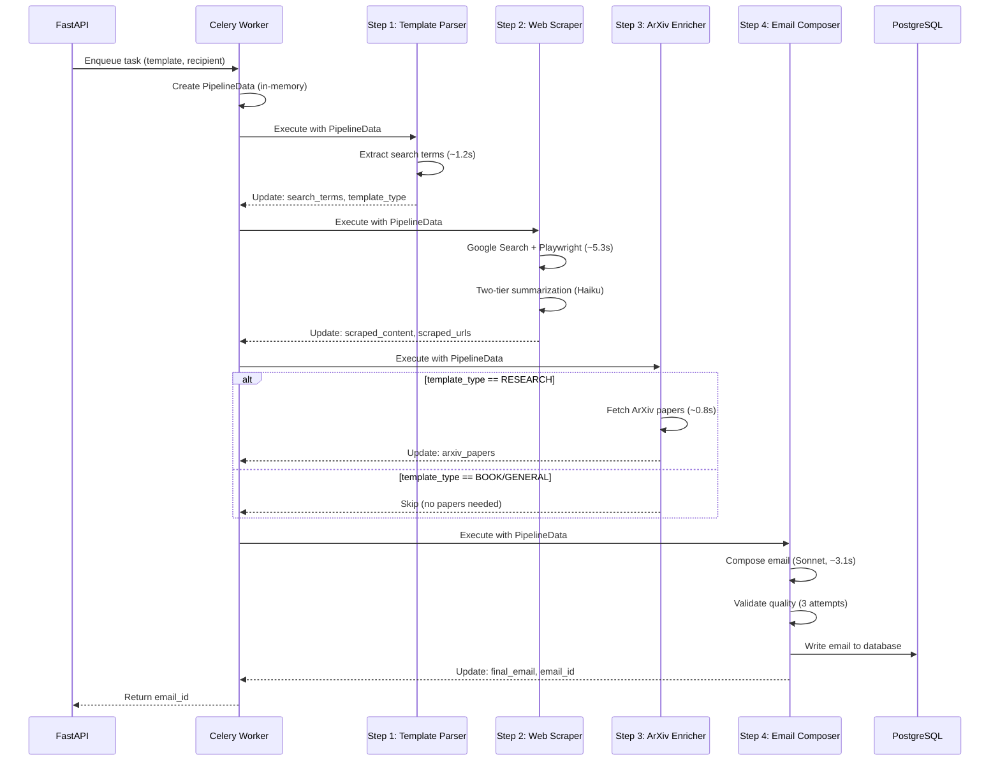

The Scribe pipeline transforms a simple email template into a personalized, research-backed outreach email through **4 sequential steps**.

## Pipeline Flow

<Steps>
  <Step title="Template Parser">
    Analyze the email template and extract search parameters
    
    - Identifies placeholders like `{{name}}`, `{{research}}`
    - Classifies template type (RESEARCH, BOOK, GENERAL)
    - Generates search queries for web scraping
    - **Execution time**: ~1.2 seconds
  </Step>
  
  <Step title="Web Scraper">
    Fetch and summarize relevant information about the recipient
    
    - Google Custom Search API for URLs
    - Playwright headless browser for content extraction
    - Two-tier summarization for large content (>30K chars)
    - **Execution time**: ~5.3 seconds (varies by website complexity)
  </Step>
  
  <Step title="ArXiv Enricher">
    Conditionally fetch academic papers (only if template_type == RESEARCH)
    
    - Queries ArXiv API for relevant publications
    - Four-factor relevance scoring
    - Returns top 5 most relevant papers
    - **Execution time**: ~0.8 seconds (when executed)
  </Step>
  
  <Step title="Email Composer">
    Generate final personalized email and persist to database
    
    - Claude Sonnet 4.5 for high-quality generation
    - Three-attempt validation system for quality assurance
    - Single atomic database write (email + metadata)
    - **Execution time**: ~3.1 seconds
  </Step>
</Steps>

## Typical Execution Time

**Average**: ~10.4 seconds (varies by template complexity and web scraping)

<AccordionGroup>
  <Accordion title="Execution Time Breakdown">
    | Step | Average Time | Variance | Primary Bottleneck |
    |------|--------------|----------|--------------------|
    | Template Parser | 1.2s | Low | LLM API call (Claude Haiku) |
    | Web Scraper | 5.3s | High | Playwright rendering + JavaScript execution |
    | ArXiv Enricher | 0.8s | Low | ArXiv API response time |
    | Email Composer | 3.1s | Medium | LLM generation + quality validation |
    | **Total** | **10.4s** | Medium | Network latency + LLM processing |
    
    **Variance Factors**:
    - Web Scraper: Highly dependent on website complexity, JavaScript load time, and number of pages
    - Email Composer: Validation retries can add 2-6 seconds if first attempt fails quality checks
  </Accordion>
</AccordionGroup>

## Design Goals

### Stateless In-Memory Processing

All pipeline state lives in a single `PipelineData` object passed through each step. **No intermediate database writes**—only the final email is persisted.

```python pipeline/models/core.py
@dataclass
class PipelineData:
    """In-memory state passed between pipeline steps. Not persisted to database."""
    
    # Input data (set by Celery task from API request)
    task_id: str
    user_id: str
    email_template: str
    recipient_name: str
    recipient_interest: str
    
    # Step 1 outputs (TemplateParser)
    search_terms: List[str] = field(default_factory=list)
    template_type: TemplateType | None = None
    
    # Step 2 outputs (WebScraper)
    scraped_content: str = ""
    scraped_urls: List[str] = field(default_factory=list)
    
    # Step 3 outputs (ArxivEnricher)
    arxiv_papers: List[Dict[str, Any]] = field(default_factory=list)
    
    # Step 4 outputs (EmailComposer)
    final_email: str = ""
    
    # Metadata for final DB write
    metadata: Dict[str, Any] = field(default_factory=dict)
    
    # Transient data (logged to Logfire, not persisted)
    step_timings: Dict[str, float] = field(default_factory=dict)
    errors: List[str] = field(default_factory=list)
```

**Benefits**:
- **Performance**: No I/O between steps, all operations in RAM
- **Simplicity**: Only 1 database write per pipeline execution
- **Scalability**: Workers scale horizontally with no database bottleneck
- **Observability**: Logfire captures full execution history without DB writes

### Observable by Default

Every pipeline step is automatically instrumented with Logfire spans for distributed tracing:

```python pipeline/core/runner.py
async def execute(
    self,
    pipeline_data: PipelineData,
    progress_callback: Optional[Callable] = None
) -> StepResult:
    """Execute step with full observability."""
    start_time = time.perf_counter()
    
    # Create Logfire span for this step
    with logfire.span(
        f"pipeline.{self.step_name}",
        task_id=pipeline_data.task_id,
        step=self.step_name
    ):
        try:
            # Execute step-specific logic
            result = await self._execute_step(pipeline_data)
            
            # Record timing
            duration = time.perf_counter() - start_time
            pipeline_data.add_timing(self.step_name, duration)
            
            logfire.info(
                f"{self.step_name} completed",
                task_id=pipeline_data.task_id,
                duration=duration
            )
            return result
        except Exception as e:
            logfire.error(
                f"{self.step_name} failed",
                task_id=pipeline_data.task_id,
                error=str(e),
                exc_info=True
            )
            raise StepExecutionError(self.step_name, e)
```

### Resilient Error Handling

The pipeline distinguishes between **fatal** and **non-fatal** errors:

**Fatal Errors** (stop pipeline):
- Template Parser fails (can't proceed without search terms)
- Email Composer database write fails
- Invalid input data (Pydantic validation)

**Non-Fatal Errors** (continue with degraded service):
- Some URLs fail to scrape (continue with successful ones)
- ArXiv API timeout (continue without papers)
- Email validation warnings (still persist email)

## Key Features

<CardGroup cols={2}>
  <Card title="Cost-Effective" icon="dollar-sign">
    Average cost per email: **$0.027**
    
    Uses Claude Haiku for extraction tasks, Sonnet only for final composition
  </Card>
  
  <Card title="Anti-Hallucination" icon="shield-check">
    Multi-source verification in web scraping
    
    Facts must appear in multiple pages or marked as `[UNCERTAIN]`
  </Card>
  
  <Card title="Quality Assurance" icon="check-circle">
    Three-attempt validation system
    
    Ensures recipient name appears, no unfilled placeholders, mentions research
  </Card>
  
  <Card title="Memory Efficient" icon="microchip">
    Runs on 512MB RAM
    
    Smart chunking and sequential processing to stay within memory limits
  </Card>
</CardGroup>

## Pipeline Execution Diagram



## Next Steps

<CardGroup cols={2}>
  <Card title="Architecture" icon="diagram-project" href="/pipeline/architecture">
    Learn about the BasePipelineStep pattern, PipelineRunner orchestration, and stateless design
  </Card>
  
  <Card title="Data Flow" icon="arrow-right-arrow-left" href="/pipeline/data-flow">
    Understand how PipelineData flows through steps and what each step reads/writes
  </Card>
</CardGroup>